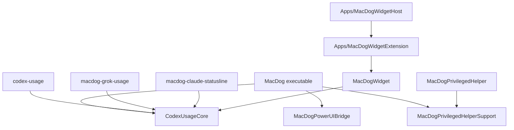
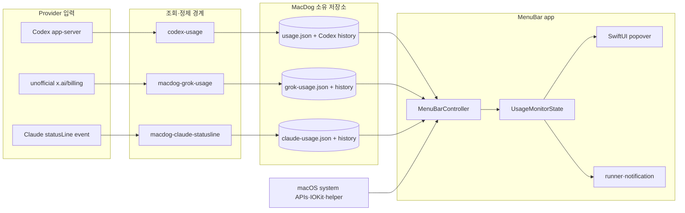
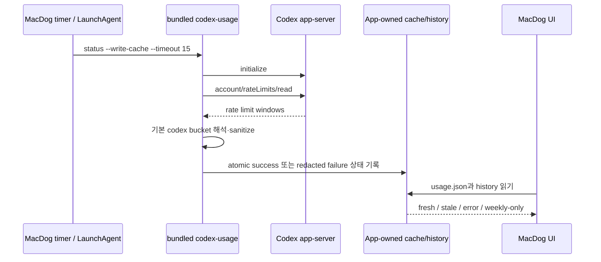
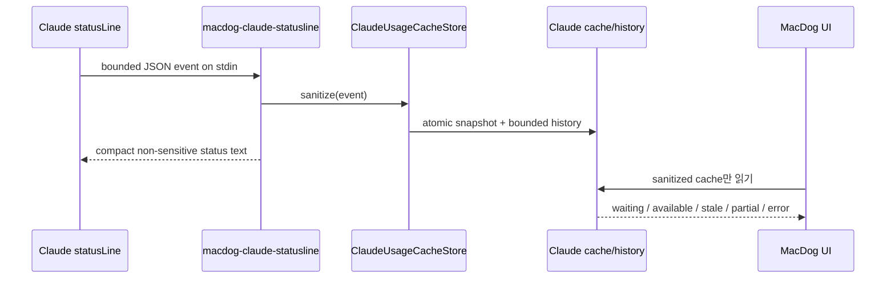
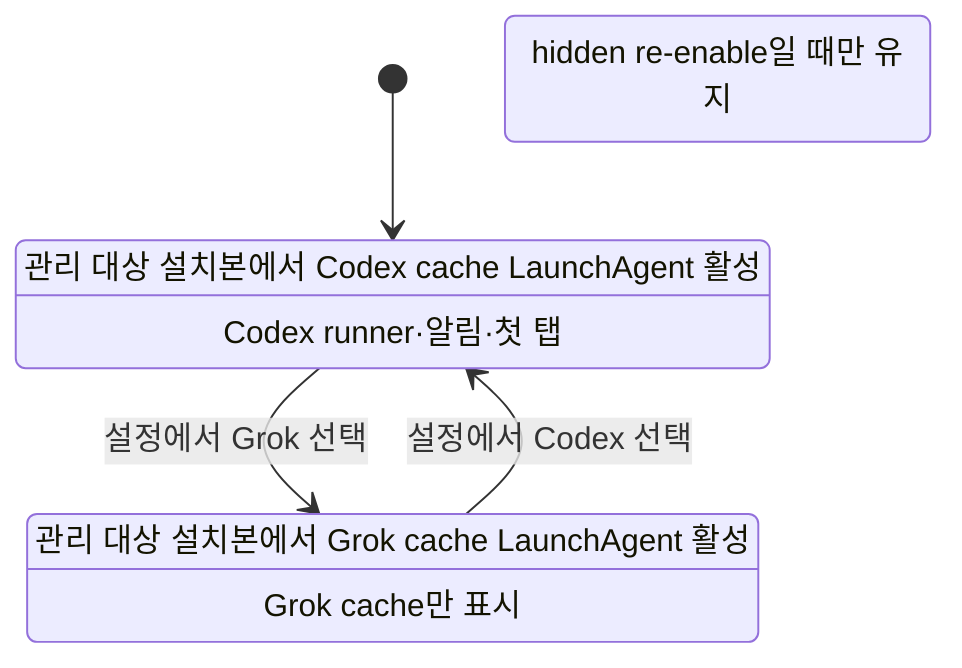

# MacDog 아키텍처

이 문서는 코드를 수정하기 전에 알아야 할 target 구성, 런타임 데이터 흐름, 파일 소유권과
주요 진입점을 설명합니다. 제품 사용법은 [../../README.md](../../README.md), 실행 환경은
[DevelopmentEnvironment.md](DevelopmentEnvironment.md)를 먼저 확인해도 됩니다.

## 전체 target 구성

`Package.swift`가 핵심 build graph의 기준입니다. 화살표는 “의존한다”를 뜻합니다.



| Product/target | 위치 | 책임 |
| --- | --- | --- |
| `CodexUsageCore` | `Sources/CodexUsageCore` | Codex app-server client, 사용량 모델/formatter, cache/history, Claude sanitizer/cache, Grok weekly sanitizer/cache |
| `codex-usage` | `Sources/CodexUsageCLI` | `status`, `doctor`, JSON 출력, app-owned cache writer |
| `macdog-grok-usage` | `Sources/GrokUsageCLI` | Grok weekly-only `status`/`--write-cache`, unofficial billing writer |
| `macdog-claude-statusline` | `Sources/ClaudeUsageBridgeCLI` | bounded stdin event 수신, Claude 사용량 정제와 별도 cache writer. 기본 UI에서는 숨김 |
| `MacDog` | `Sources/MacDog` | 메뉴바 앱, popover, 러너, 시스템 상태, 알림, user component orchestration |
| `MacDogPowerUIBridge` | `Sources/MacDogPowerUIBridge` | macOS power/charge limit 관련 Objective-C bridge |
| `MacDogPrivilegedHelperSupport` | `Sources/MacDogPrivilegedHelperSupport` | helper XPC 계약, 허용 command, 설치 script 생성 |
| `MacDogPrivilegedHelper` | `Sources/MacDogPrivilegedHelper` | optional root helper executable |
| `MacDogWidget` | `Sources/MacDogWidget` | WidgetKit view/provider와 shared cache reader |
| Widget host/extension | `Apps` | opt-in Widget packaging용 Xcode target |

## 런타임 컴포넌트



`MenuBarController`는 앱의 orchestration 중심입니다. status item과 popover를 만들고, cache와
history를 refresh하며, system metrics·sleep prevention·battery/helper·notification·desktop pet
상태를 `UsageMonitorState`에 모읍니다. `UsageMonitorState`는 선택 provider만 첫 탭과 러너에
노출하고 다른 provider 값으로 fallback하지 않습니다.

## Codex 사용량 흐름



핵심 해석 규칙:

| 입력 | 해석 |
| --- | --- |
| `windowDurationMins = 300` | 5시간 window. 일시 미제공 가능 |
| `windowDurationMins = 10080` | 주간 window. 성공 cache에 필수 |
| `usedPercent` | 공식 사용률. 잔여율은 `100 - usedPercent` |
| `resetsAt` | Unix epoch seconds. 화면에서는 local timezone으로 변환 |
| 기본 bucket | `rateLimitsByLimitId.codex` |
| 추가 bucket | advanced/debug 정보. 기본 화면과 분리 |

주간 window만 있으면 partial success로 저장하고 주간 history·runner·알림을 계속 갱신합니다.
없는 5시간 값은 합성하지 않습니다. 1번 탭 통합 게이지에서는 해당 항목을 숨기고, tooltip 등에서는
“현재 제공되지 않음”으로 둡니다. 5시간 window가 돌아오면 기존 5시간 history를 보존한 채
sampling과 pace를 재개합니다.

초기화권 상세 조회만 제한된 예외 경계에서 access token을 메모리로 받아 backend 요청에 즉시
사용할 수 있습니다. token은 출력·cache·log·fixture에 남기지 않습니다. 이 경계를 수정하려면
`AGENTS.md`의 인증 규칙과 privacy test를 함께 검토해야 합니다.

## Grok 사용량 흐름

```mermaid
sequenceDiagram
    participant Timer as MacDog timer / LaunchAgent
    participant CLI as bundled macdog-grok-usage
    participant Billing as unofficial x.ai/billing
    participant Cache as grok-usage.json / history
    participant App as MacDog UI

    Timer->>CLI: status --write-cache
    CLI->>CLI: auth.json sibling read; refresh under lock only if expired or 401
    CLI->>Billing: GET /v1/billing?format=credits
    Billing-->>CLI: creditUsagePercent
    CLI->>CLI: weekly-only sanitize, drop token and raw payload
    CLI->>Cache: atomic success 또는 redacted failure 상태 기록
    App->>Cache: grok-usage.json과 history 읽기
    Cache-->>App: fresh / stale / error / empty
```

핵심 해석 규칙:

| 입력 | 해석 |
| --- | --- |
| `creditUsagePercent` | 주간 `usedPercent`. 잔여율은 `100 - usedPercent` |
| 5시간 window | 없음. UI는 `현재 제공되지 않음` |
| `resetsAt` | 확인된 unix epoch만. 모르면 생략하고 합성하지 않음 |
| Extra Credits / prepaid / MONTHLY | 거부. 기본 UI 입력이 아님 |
| `XAI_API_KEY` | SuperGrok 주간 pool 인증으로 쓰지 않음 |

Grok cache는 Codex/Claude 파일과 분리합니다. live billing과 `~/.grok/auth.json` 조회는
사용자 승인 없이 하지 않습니다. unofficial 경로이므로 fixture 검증과 live 검증을 구분합니다.

## Claude 사용량 흐름



Claude 경로는 자동 account discovery를 하지 않습니다. 앱은 Claude settings, auth, Keychain,
transcript, raw event를 읽지 않습니다. 사용자가 statusLine bridge를 연결해야만 cache가 갱신되며,
유료 계정이 없는 환경에서 empty/waiting 상태는 정상입니다. 현재 실제 유료 Claude
`rate_limits` event는 미확인 상태이므로 fixture 검증과 live 검증을 구분합니다.

## 선택 provider 상태 전이



- 선택값은 단일 preference입니다. 기본 UI visible 값은 `Codex`와 `Grok`입니다.
- 저장된 `claude`는 hidden re-enable이 켜진 경우가 아니면 `codex`로 되돌립니다.
- provider를 바꾸면 탭 label, refresh route, runner phase, notification source가 함께 바뀝니다.
- 두 provider를 합산·비교하거나 이전 provider 수치로 empty state를 채우지 않습니다.
- `/Applications` 또는 `~/Applications`의 관리 대상 설치본에서 mode를 바꾸면 user
  component installer가 Codex 또는 Grok cache LaunchAgent를 맞춥니다. `dist/MacDog.app`은
  설치 구성요소를 관리하지 않으므로 provider 전환이 LaunchAgent를 설치·제거하지 않습니다.

## 소스 트리 지도

| 경로 | 처음 볼 파일 | 변경 시 함께 볼 영역 |
| --- | --- | --- |
| `Sources/CodexUsageCore/AppServer` | `CodexAppServerClient.swift` | protocol fixture, timeout/redaction test |
| `Sources/CodexUsageCore/Usage` | `CodexUsageService.swift` | model/formatter, CLI JSON, reset credit privacy |
| `Sources/CodexUsageCore/Cache` | `CodexUsageCache.swift` | weekly/five-hour/reset history, stale/error, atomic write |
| `Sources/CodexUsageCore/Claude` | `ClaudeUsageCache.swift` | statusLine sanitizer, Claude history, privacy test |
| `Sources/CodexUsageCore/Grok` | `GrokUsageCache.swift` | weekly-only sanitizer, Grok history, auth.json sibling |
| `Sources/CodexUsageCLI` | `main.swift` | README CLI 계약, cache writer, `doctor` |
| `Sources/GrokUsageCLI` | `main.swift` | Grok weekly writer, token 미출력 |
| `Sources/ClaudeUsageBridgeCLI` | `main.swift` | bounded stdin/output, bundle packaging gate |
| `Sources/MacDog` | `MacDogMain.swift`, `MenuBarController.swift`, `UsagePopoverView.swift` | app lifecycle, timers, root popover, user components |
| `Sources/MacDog/Popover` | `CodexUsagePanel.swift`, `GrokUsagePanel.swift`, `ClaudeUsagePreviewPanel.swift`와 각 panel | tab UI, screenshot renderer, accessibility identifier |
| `Sources/MacDog/Resources` | character profile manifest | character verifier와 screenshot test |
| `Sources/MacDogWidget` | widget view/provider | app group cache, empty/stale/error, deep link |
| `Sources/MacDogPrivilegedHelperSupport` | `PrivilegedHelperContract.swift` | helper executable, install/preflight/XPC tests |
| `Tests/CodexUsageCoreTests` | 기능별 `*Tests.swift` | core schema와 parser regression |
| `Tests/MacDogTests` | UI/state/installer tests | app behavior와 screenshot renderer |
| `Tests/MacDogPrivilegedHelperSupportTests` | helper contract tests | 허용 command와 install script |
| `script` | `check.sh`, `build_and_run.sh` | CI, bundle, 설치, release 계약 |
| `.github/workflows` | `ci.yml`, guardrail/release workflows | required checks와 release 권한 |

## 주요 진입점

| 상황 | 진입점 | 추적 방향 |
| --- | --- | --- |
| 앱 시작 | `Sources/MacDog/MacDogMain.swift` | `AppDelegate` → `MenuBarController.start()` |
| popover 상태 갱신 | `Sources/MacDog/MenuBarController.swift` | cache store → `UsageMonitorState` → SwiftUI view |
| 선택 provider 계산 | `Sources/MacDog/UsageMonitorState.swift` | preference → runner/notification/tab state |
| Codex live 조회 | `Sources/CodexUsageCLI/main.swift` | `CodexUsageService` → app-server client → cache store |
| Grok weekly 조회 | `Sources/GrokUsageCLI/main.swift` | `GrokUsageFetchService` → billing sanitizer → Grok cache |
| Claude event 정제 | `Sources/ClaudeUsageBridgeCLI/main.swift` | `ClaudeUsageCacheStore` → snapshot/history |
| 첫 실행 설치/복구 | `Sources/MacDog/UserComponentInstaller.swift` | CLI symlink, usage LaunchAgent, provider reconciliation |
| 로그인 실행 | `Sources/MacDog/LoginLaunchController.swift` | `SMAppService` status/register/unregister |
| helper IPC | `Sources/MacDogPrivilegedHelperSupport` | contract → client/service → install/preflight |
| 전체 검증 | `script/check.sh` | 40개 안팎의 static, Swift, bundle, release gate |

## 데이터와 파일 소유권

| 데이터 | 기본 경로 | writer | reader | 주의 |
| --- | --- | --- | --- | --- |
| Codex snapshot | `~/Library/Application Support/MacDog/usage.json` | `codex-usage` | MacDog, optional widget mirror | cache schema breaking change 금지 |
| 5시간 history | 같은 디렉터리의 `usage-five-hour-history.json` | `codex-usage` | Codex UI | 5시간 미제공 중에도 기존 history 보존 |
| 주간 history | `usage-weekly-history.json` | `codex-usage` | Codex graph/pace | 같은 reset 안에서 표시 잔여율 비증가 |
| reset history | `usage-reset-window-history.json` | `codex-usage` | 비교/진단 UI | 완료 window의 축약 record만 저장 |
| Grok snapshot | `grok-usage.json` | `macdog-grok-usage` | MacDog | token/원문 billing 저장 금지 |
| Grok history | `grok-usage-history.json` | `macdog-grok-usage` | MacDog | weekly-only sanitized history |
| Grok lock | `grok-usage.lock` | `macdog-grok-usage` | Grok writer | concurrent atomic write 보호 |
| Claude snapshot | `claude-usage.json` | Claude bridge | MacDog | raw event/transcript 저장 금지 |
| Claude history | `claude-usage-history.json` | Claude bridge | MacDog | sanitized bounded history |
| Claude lock | `claude-usage.lock` | Claude bridge | Claude bridge | concurrent atomic write 보호 |
| preferences | `com.dhseo.macdog.MacDog` UserDefaults | MacDog | MacDog | reset은 명시적 uninstall 옵션 |
| optional widget mirror | `~/Library/Group Containers/group.com.dhseo.macdog.MacDog/usage.json` | opt-in CLI mirror | WidgetKit | provisioning 없는 ad-hoc build로 실제 UI 완료 주장 금지 |
| user LaunchAgent | `~/Library/LaunchAgents/com.dhseo.macdog.usage-cache.plist` | installer | launchd | Codex mode에서만 유지 |
| Grok LaunchAgent | `~/Library/LaunchAgents/com.dhseo.macdog.grok-usage-cache.plist` | installer | launchd | Grok mode에서만 유지 |
| user CLI link | `~/bin/codex-usage` | installer | 사용자/LaunchAgent | 설치 app payload를 가리켜야 함 |
| helper tool | `/Library/PrivilegedHelperTools/com.dhseo.macdog.helper` | 승인된 helper 설치 | launchd | 관리자 승인 필요 |
| helper plist | `/Library/LaunchDaemons/com.dhseo.macdog.helper.plist` | 승인된 helper 설치 | launchd | 관리자 승인 필요 |

## UI와 상태 소유권

| 기능 | 상태 원천 | UI 갱신/제어 |
| --- | --- | --- |
| 사용량 탭 | selected provider cache/history | `MenuBarController`, `UsageMonitorState` |
| 메뉴바 러너 | 현재 제공되는 선택 provider window의 최대 사용률 | `UsageMonitorState` runner phase |
| 로컬 알림 | 선택 provider threshold와 opt-in preference | notification dispatcher |
| 활성 자원 | macOS system APIs | 주기적 system metrics refresh |
| 잠들지 않기 | local state, power assertion, optional helper | sleep prevention controller |
| 배터리 한도 | native Charge Limit bridge | battery controller |
| 데스크톱 펫 | character profile, runner/state preference | desktop pet controller |
| 설정 | UserDefaults와 실제 system registration 상태 | settings view + controllers |

## 변경 유형별 추적 범위

| 변경하려는 것 | 최소 함께 확인할 것 |
| --- | --- |
| app-server response 해석 | core model/parser, redacted fixture, `status --json`, cache writer, protocol drift verifier |
| cache schema | core store, CLI, MacDog reader, Widget reader, README·AGENTS·ROADMAP 계약 |
| usage graph/pace | history store, reset 경계, selected provider state, screenshot renderer |
| provider 설정 | preference migration, user component reconciliation, runner, 알림, refresh, 첫 탭 |
| popover layout | SwiftUI panel, accessibility identifier, screenshot test, README snapshot |
| 캐릭터 | desktop pet 원본 프레임, profile manifest, menu derivation, tab assets, character verifier |
| helper command | helper allowlist/contract, XPC client/service, install script, state/preflight test |
| WidgetKit | source/provider, shared cache mirror, Xcode host/extension, opt-in packaging; 실제 UI는 별도 |
| 설치/패키징 | build script, bundle verifier, install dry-run, release packaging, Finder manual smoke |

## 추천 코드 탐색 순서

1. `Package.swift`에서 target graph를 봅니다.
2. `MacDogMain.swift`와 `MenuBarController.start()`로 app lifecycle을 따라갑니다.
3. `UsageMonitorState.swift`에서 selected provider와 UI 파생 상태를 확인합니다.
4. Codex 작업이면 `CodexUsageCLI/main.swift` → `CodexUsageService.swift` → cache/history 순서로 봅니다.
5. Grok 작업이면 `GrokUsageCLI/main.swift` → `Sources/CodexUsageCore/Grok` 순서로 봅니다.
6. Claude 작업이면 `ClaudeUsageBridgeCLI/main.swift` → `Sources/CodexUsageCore/Claude` 순서로 봅니다.
7. 같은 이름의 `Tests/*Tests.swift`와 `script/verify_*contract.sh`를 찾아 계약을 확인합니다.
8. UI 변경이면 screenshot renderer와 [../Images/README](../Images/README) 기준 이미지까지 확인합니다.
