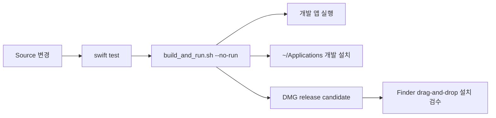

# MacDog 개발 환경

이 문서는 새 개발 장비에서 저장소를 검증하고, 안전하게 첫 변경을 만드는 절차를 설명합니다.
명령의 정확한 영향 범위는 [../Scripts.md](../Scripts.md)가 최종 기준입니다.

## 지원 환경과 도구

| 항목 | 요구/권장 | 확인 명령 | 비고 |
| --- | --- | --- | --- |
| macOS | 14 이상 | `sw_vers` | 앱의 minimum deployment target |
| Xcode | `/Applications/Xcode.app`의 정식 Xcode 권장 | `DEVELOPER_DIR=/Applications/Xcode.app/Contents/Developer xcodebuild -version` | AppKit, SwiftUI, WidgetKit, build tools 제공 |
| Swift | Swift tools 6.0 호환 | `DEVELOPER_DIR=/Applications/Xcode.app/Contents/Developer xcrun swift --version` | `Package.swift` 기준 |
| Git | 현재 macOS/Xcode CLI tools 버전 | `git --version` | branch/PR/release head 추적 |
| Node.js/npm | 문서 lint 시 권장 | `node --version`, `npm --version` | 앱 runtime dependency는 아님 |
| GitHub CLI | PR·CI·release 운영 시 선택 | `gh --version` | 인증과 서버 변경은 작업 승인 범위 확인 |

SwiftPM 외부 package dependency는 현재 없습니다. 빌드가 package download 때문에 실패한다면
새 dependency보다 Xcode/SDK 선택, DerivedData, network 환경을 먼저 확인합니다.

## 저장소를 받은 직후

```sh
cd /path/to/MacDog
git status --short --branch
git remote -v
DEVELOPER_DIR=/Applications/Xcode.app/Contents/Developer xcodebuild -version
DEVELOPER_DIR=/Applications/Xcode.app/Contents/Developer xcrun swift --version
```

`git status`가 비어 있지 않으면 기존 변경의 소유자와 목적을 먼저 확인합니다. 다른 사람의 변경을
삭제하거나 덮어쓰지 않습니다. macOS가 Command Line Tools만 선택한 경우에는 명령마다 위처럼
`DEVELOPER_DIR`를 지정하거나 팀 환경에 맞게 Xcode 선택을 정리합니다.

## 첫 검증

가장 작은 확인부터 넓혀 갑니다.

```sh
git diff --check
DEVELOPER_DIR=/Applications/Xcode.app/Contents/Developer xcrun swift test --no-parallel
MACDOG_APP_VERSION=9.9.9 ./script/check.sh --no-run
```

| 명령 | 무엇을 확인하는가 | 파일/환경 영향 |
| --- | --- | --- |
| `git diff --check` | whitespace 오류 | 읽기 전용 |
| `xcrun swift test --no-parallel` | core, app state, helper support unit/integration test | `.build` 갱신 |
| `check.sh --no-run` | static gate, Swift test, bundle, packaging dry-run, 문서/계약 verifier | `.build`, `dist` 산출물을 갱신할 수 있으나 앱은 실행하지 않음 |

`check.sh`는 `MACDOG_APP_VERSION` 또는 `MACDOG_RELEASE_VERSION`이 없으면 의도적으로 실패합니다.
`9.9.9`는 CI가 사용하는 비릴리즈 검증용 명시 버전입니다. `--no-run`은 앱 실행만 막으며 build와
현재 설치 상태 조회까지 모두 생략하는 옵션은 아닙니다.

문서만 바꿨다면 최소 검증은 다음과 같습니다.

```sh
git diff --check
npx --yes markdownlint-cli2@0.22.1
```

README의 이미지 참조나 snapshot 설명을 바꿨다면 다음도 실행합니다.

```sh
./script/verify_readme_screenshots.sh
```

## 빌드·실행·설치 모드



| 목적 | 명령 | 결과 | 주의 |
| --- | --- | --- | --- |
| Swift package test | `xcrun swift test --no-parallel` | `.build` test binary | GUI를 열지 않음 |
| app bundle만 빌드 | `MACDOG_APP_VERSION=9.9.9 ./script/build_and_run.sh --no-run` | `dist/MacDog.app` | 기존 `dist`를 갱신 |
| app 빌드·실행 | `MACDOG_APP_VERSION=9.9.9 ./script/build_and_run.sh` | 새 app process | 실행 중 앱을 정리하거나 GUI를 열 수 있음 |
| 개발용 설치 계획 | `MACDOG_APP_VERSION=9.9.9 ./script/install.sh --dry-run` | 변경 대상 출력 | 실제 파일을 바꾸지 않음 |
| 개발용 설치 | `MACDOG_APP_VERSION=9.9.9 ./script/install.sh` | `~/Applications`, CLI link, LaunchAgent | 사용자 홈과 login/runtime 상태 변경 |
| optional Widget build | build/install 명령에 `--with-widget` | `.appex` 포함 opt-in bundle | 기본 앱/DMG 완료 조건이 아님 |
| optional helper 설치 | install 명령에 `--with-helper` 또는 `--helper-only` | `/Library` tool/plist | 관리자 승인 필요 |
| release 후보 | `MACDOG_RELEASE_VERSION=x.y.z ./script/package_release.sh` | DMG와 SHA-256 | 릴리즈 승인·체크리스트 필요 |

개발용 `install.sh`, `cp`, `ditto`, mount 뒤 직접 복사는 최종 사용자 설치 검수의 대체가
아닙니다. 릴리즈 검수는 published DMG를 Finder에서 열고 보이는 `MacDog.app`을
`Applications`로 실제 drag-and-drop해야 합니다.

실행형 `build_and_run.sh`는 기존 `MacDog` 프로세스를 종료한 뒤 `dist` 앱을 실행합니다.
`dist/MacDog.app`은 CLI symlink나 LaunchAgent를 설치하지 않지만, 설치본과 같은 UserDefaults와
cache를 사용할 수 있고 cache가 비어 있으면 bundled CLI refresh를 시도할 수 있습니다. 기존
설치본과 나란히 검증할 때는 어느 app path가 실행 중인지 반드시 확인합니다.

live 사용량을 건드리지 않는 demo UI가 목적이면 다음처럼 명시합니다. 다만 같은 UserDefaults
domain의 preference migration은 일어날 수 있습니다.

```sh
MACDOG_DEMO_MODE=1 \
MACDOG_APP_VERSION=9.9.9 \
./script/build_and_run.sh
```

## 주요 환경변수

| 변수 | 의미 | 사용 경계 |
| --- | --- | --- |
| `MACDOG_APP_VERSION` | check/build/install용 명시 app version | 일반 개발 검증에는 `9.9.9` 사용 가능 |
| `MACDOG_RELEASE_VERSION` | package/release용 명시 version | 실제 릴리즈 값과 release head를 확인 |
| `MACDOG_APP_BUILD` | app bundle build number | 기본값 `1` |
| `DEVELOPER_DIR` | 사용할 Xcode toolchain | 표준 경로는 `/Applications/Xcode.app/Contents/Developer` |
| `MACDOG_DEMO_MODE=1` | live usage 대신 demo state | GUI 실행 자체는 발생 |
| `MACDOG_OPEN_POPOVER_ON_LAUNCH=1` | 시작 직후 popover 표시 | screenshot/manual UI 보조 |
| `MACDOG_INCLUDE_WIDGET=1` | WidgetKit opt-in build | `build_and_run.sh` 전용 호환 입력. install/package는 반드시 `--with-widget` 사용 |
| `CODEX_CLI_PATH` | Codex executable 자동 탐색 override | 실행 파일 경로만 지정. auth 진단 용도가 아님 |
| `CODEX_HOME` | Codex home override | auth 내용을 직접 읽는 용도로 사용 금지 |
| `MACDOG_ALLOW_OSASCRIPT_ADMIN=1` | 비대화형 helper 관리자 승인 fallback | 일반 개발에서 사용하지 않음 |

## 자주 쓰는 focused test

```sh
# Core cache와 history
DEVELOPER_DIR=/Applications/Xcode.app/Contents/Developer xcrun swift test \
  --filter CodexUsageCacheTests

# Claude statusLine snapshot/sanitizer
DEVELOPER_DIR=/Applications/Xcode.app/Contents/Developer xcrun swift test \
  --filter ClaudeStatusLineSnapshotTests

# app user component 설치/복구
DEVELOPER_DIR=/Applications/Xcode.app/Contents/Developer xcrun swift test \
  --filter UserComponentInstallerTests

# popover screenshot renderer
DEVELOPER_DIR=/Applications/Xcode.app/Contents/Developer xcrun swift test \
  --filter PopoverScreenshotRendererTests

# helper contract
DEVELOPER_DIR=/Applications/Xcode.app/Contents/Developer xcrun swift test \
  --filter PrivilegedHelperContractTests
```

정확한 test class 이름이 바뀌었으면 `rg 'final class .*Tests' Tests`로 현재 이름을 먼저 찾습니다.
focused test가 통과해도 app/core 변경은 전체 `swift test`와 해당 verifier로 마무리합니다.

## CLI 개발과 진단

빌드 산출물 기준 예시:

```sh
DEVELOPER_DIR=/Applications/Xcode.app/Contents/Developer xcrun swift build \
  --product codex-usage
.build/debug/codex-usage status --json
.build/debug/codex-usage doctor
```

| 명령 | 용도 | 주의 |
| --- | --- | --- |
| `codex-usage status` | 사람이 읽는 현재 사용량 | app-server live 조회가 발생할 수 있음 |
| `codex-usage status --json` | 공용 JSON schema 형태의 live 결과 확인 | raw app-server response가 아니라 정제된 출력 |
| `codex-usage status --write-cache` | app-owned cache 갱신 | 기본 cache/history 파일을 변경 |
| `codex-usage doctor` | 설치·cache·app-server live 진단 | token이나 auth 원문을 출력하면 안 됨 |
| `codex-usage status --watch 60` | 장시간 polling | 명시 승인 없이 실행하지 않음 |

`status --json`과 `doctor`도 offline fixture 조회가 아닙니다. live app-server를 호출하고,
reset-credit 상세가 필요한 조건에서는 제한된 auth refresh·backend 경로가 실행될 수 있습니다.
network/auth 경계 없는 schema 회귀 확인은 redacted fixture와 자동 test를 사용합니다.

`~/.codex/auth.json`, Claude settings, Keychain, transcript를 직접 열어 문제를 진단하지 않습니다.
필요한 진단은 `doctor`, redacted log, cache health, fixture를 사용합니다.

## 로컬 경로와 정리 책임

| 경로 | 생성 주체 | 내용 | 변경/삭제 시 주의 |
| --- | --- | --- | --- |
| `.build` | SwiftPM | object와 test binary | 재생성 가능 |
| `dist/MacDog.app` | build script | 개발 app bundle | release 설치본과 혼동 금지 |
| `dist/release` | package script | DMG staging/artifact | git 추적 금지 |
| `~/Applications/MacDog.app` | 개발 installer | 개발 설치본 | `/Applications` 릴리즈 설치본과 구분 |
| `/Applications/MacDog.app` | Finder release install | 실제 사용자 설치본 | 직접 복사로 검수 대체 금지 |
| `~/bin/codex-usage` | user component installer | 설치 app 내부 CLI symlink | 현재 설치본을 가리키는지 확인 |
| `~/Library/Application Support/MacDog` | CLI/bridge | cache와 history | auth/session 저장 금지 |
| `~/Library/LaunchAgents/com.dhseo.macdog.usage-cache.plist` | installer | Codex polling job | Claude mode에서는 제거가 정상 |
| `~/Library/Logs/MacDog` | installer/LaunchAgent | user component log | 민감 원문 저장 금지 |
| `/Library/PrivilegedHelperTools/com.dhseo.macdog.helper` | 승인된 helper install | root helper | 임의 삭제/교체 금지 |
| `/Library/LaunchDaemons/com.dhseo.macdog.helper.plist` | 승인된 helper install | launchd 설정 | 관리자 승인 필요 |

> `script/uninstall.sh`는 앱, CLI link, LaunchAgent, `usage.json`, 주간 history, Claude
> cache/history/lock, widget mirror를 제거하지만 현재 구현상 `usage-five-hour-history.json`,
> `usage-reset-window-history.json`, `~/Library/Logs/MacDog`는 남을 수 있습니다. 또한
> `/Applications/MacDog.app`도 삭제 대상입니다. 삭제 전에는 반드시 `--dry-run`으로 대상과
> 보존 파일을 확인하고, 실행은 사용자 환경 변경 승인을 받은 뒤 진행합니다.

## IDE에서 시작하기

- package/core 작업은 `Package.swift`를 Xcode에서 열어도 됩니다.
- Widget host/extension과 entitlement를 볼 때는 `MacDog.xcodeproj`와 `Apps`를 함께 확인합니다.
- `MacDog.xcodeproj`의 native target은 Widget host/extension용입니다. 메인 메뉴바 앱은 SwiftPM
  executable을 `script/build_and_run.sh`가 `dist/MacDog.app`으로 조립하는 구조입니다.
- resource를 추가하면 SwiftPM resource processing, app bundle verifier, public repo guardrail을 모두
  확인합니다. 추적 이미지의 허용 경로는 제한되어 있으므로 임의 폴더에 PNG를 추가하지 않습니다.

## 문제별 진단 순서

| 증상 | 먼저 확인 | 다음 단계 |
| --- | --- | --- |
| 첫 탭이 갱신되지 않음 | 선택 provider, cache mtime, stale/error 문구 | Codex면 `doctor`와 LaunchAgent 상태, Claude면 bridge 입력 여부 |
| Codex 5시간 값만 없음 | 주간 window가 정상인지 확인 | weekly-only 정상 상태로 처리. 0% 합성 금지 |
| Claude 화면이 입력 대기 | `claude-usage.json` 존재/mtime | 유료 계정과 statusLine bridge 연결 여부를 분리. auth/settings 직접 열지 않음 |
| 앱이 두 개 보임 | 실행 중 app path와 `dist`, `~/Applications`, `/Applications` | release smoke cleanup 문서를 따르고 임의 bundle을 설치원으로 쓰지 않음 |
| UI snapshot 차이 | source view와 renderer test | `verify_readme_screenshots.sh`; 실제 GUI 확인 여부는 별도 보고 |
| helper가 partial | `verify_privileged_helper_state.sh` | preflight와 XPC read-only 진단 후 설치/삭제 승인 요청 |
| 배터리 한도 불일치 | `verify_charge_limit.sh --read` | 쓰기 명령 전 사용자 승인과 복구 계획 |
| Widget이 cache를 못 읽음 | App Group signing 분류 | ad-hoc build 한계와 provisioning 필요 상태를 미확인으로 보고 |

## 작업 시작/종료 습관

작업 시작:

```sh
git status --short --branch
git log -5 --oneline
rg --files Sources Tests script Docs | less
```

작업 종료:

```sh
git diff --check
git status --short --branch
git diff --stat
```

그 사이에는 [QualityAndRelease.md](QualityAndRelease.md)의 변경 유형별 최소 검증을 적용합니다.
실행하지 않은 GUI, live provider, 설치, 장시간 test를 완료처럼 보고하지 않습니다.
