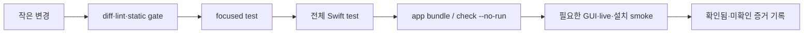

# MacDog 품질·보안·릴리즈

이 문서는 변경을 어떤 수준까지 검증해야 하는지, CI와 릴리즈가 어떤 증거를 요구하는지 정리합니다.
자동화 에이전트의 강제 규칙은 [../../AGENTS.md](../../AGENTS.md), 상세 release procedure는
[../ReleasePackaging.md](../ReleasePackaging.md)와
[../GitHubReleaseChecklist.md](../GitHubReleaseChecklist.md)가 기준입니다.

## 검증 원칙



모든 변경에 모든 단계를 기계적으로 적용하는 대신, 영향 경계를 따라 최소 검증에서 통합 검증으로
확장합니다. 다만 실패한 단계는 고치고 같은 단계부터 다시 통과하기 전 다음 단계로 넘어가지 않습니다.

## 변경 유형별 최소 검증

| 변경 | 최소 검증 | 추가 확인 |
| --- | --- | --- |
| 문서 전용 | `git diff --check`, markdownlint | README 이미지 변경 시 screenshot verifier |
| Codex parser/model/JSON | `git diff --check`, focused core test, 전체 `swift test` | protocol drift, README/AGENTS schema 용어 |
| cache/history/polling | 위 항목 + cache verifier | atomic write, stale/error, weekly-only, token 미저장 |
| Claude sanitizer/bridge | focused Claude tests + v1.8 selected-provider verifier | bounded input, raw event/transcript 미저장, bundle bridge. 기본 UI 숨김 |
| Grok weekly writer/cache | focused Grok tests + v1.9 selected-provider verifier | unofficial billing, weekly-only, token 미저장, no-fallback |
| menu bar app/state | 전체 `swift test`, app bundle build | selected provider, runner/notification/refresh, 실제 UI 여부 |
| popover layout/asset | app tests, screenshot renderer, character/screenshot verifier | 최신 app GUI를 직접 보지 않았다면 미수행 표기 |
| helper/support | helper support tests, preflight/state read-only | 실제 설치/삭제/XPC write는 승인 필요 |
| charge limit/sleep | focused tests, read-only verifier | 실제 시스템 값 변경과 장시간 closed-display test는 승인 필요 |
| WidgetKit | Swift test, opt-in Xcode/package gate | provisioning 없는 actual shared-cache UI는 완료 아님 |
| 설치/배포 | diff check, bundle/package verifier | Finder drag-and-drop, checksum, `hdiutil`, final-state |

대표 명령:

```sh
git diff --check
DEVELOPER_DIR=/Applications/Xcode.app/Contents/Developer xcrun swift test --no-parallel
MACDOG_APP_VERSION=9.9.9 ./script/check.sh --no-run
```

메인 메뉴바 앱은 `MacDog.xcodeproj`의 native app target이 아니라 SwiftPM executable을 script가
직접 조립합니다. 따라서 기본 app bundle의 packaging 계약은 `build_and_run.sh --no-run`과
`verify_app_bundle.sh`가 함께 검증합니다. Xcode project build는 opt-in Widget host/extension을
검증할 때 `MacDogWidgetHost` scheme과 `CODE_SIGNING_ALLOWED=NO` 조건으로 별도 적용합니다.

## 테스트와 gate 지도

| 계층 | 위치/명령 | 주로 잡는 회귀 |
| --- | --- | --- |
| Core unit/integration | `Tests/CodexUsageCoreTests` | parser, formatter, cache/history, reset, Claude sanitizer |
| App state/UI model | `Tests/MacDogTests` | selected provider, runner, popover layout, installer, notifications |
| Helper contract | `Tests/MacDogPrivilegedHelperSupportTests` | allowlist, validation, install script, XPC contract |
| Contract shell gate | `script/verify_*contract.sh --self-test` | source·test·문서 간 제품 계약 drift |
| Bundle/package gate | `verify_app_bundle.sh`, `verify_release_packaging.sh` | payload, version, helper, widget 제외, DMG 구조 |
| Public repo guardrail | `verify_public_repo_guardrails.sh` | 필수 문서, secret pattern, 대형 파일, action allowlist |
| Manual smoke | 설치된 app, Finder, provider live data | GUI 배치, 실제 path, launchd, 설치 사용자 경험 |

`script/check.sh --no-run`은 위 gate를 넓게 묶는 표준 검증입니다. 앱은 실행하지 않지만 build,
`dist` 갱신, 설치 상태 readback을 수행할 수 있습니다. 문서 전용 변경에 무조건 실행해야 하는 최소
조건은 아니지만, release나 계약 문서가 바뀌면 실행 범위를 넓히는 편이 안전합니다.

## GitHub CI

| Workflow | trigger/역할 | 성공 의미 |
| --- | --- | --- |
| `CI` | PR과 main 변경 | `MACDOG_APP_VERSION=9.9.9 ./script/check.sh --no-run` 통과 |
| public guardrails | PR과 main 변경 | 저장소 hygiene, workflow policy, 민감정보·대형 파일 gate 통과 |
| Release Candidate | 수동 release 입력 | 선택한 workflow ref 기준 DMG와 checksum 생성. 운영 절차가 final release head 선택을 요구 |
| Draft Release | signed tag가 존재할 때 수동 입력 | target/tag/assets를 검증한 draft 생성 |
| Stable Release | 별도 권한 milestone | Developer ID/notarization 조건. 현재 기본 release 경로가 아님 |

일반 기여는 branch에서 PR을 만들고 required status check와 review를 통과합니다. `main` 직접 반영은
현재 작업에 대한 명시 승인 예외가 있을 때만 사용하며, 문서에 예외를 일반 절차처럼 남기지 않습니다.

## 개인정보·보안 체크리스트

### 금지 데이터

- access/refresh token, cookie, session material, auth header
- `~/.codex/auth.json` 원문과 일반 진단 목적의 직접 read 결과
- `~/.grok/auth.json` 원문과 사용자 승인 없는 billing 조회
- Claude auth/settings/Keychain 내용
- Claude transcript 또는 raw statusLine event
- 민감정보 검토 전 app-server 또는 Grok billing response 전체 원문

### 허용되는 경계

- UI와 Widget은 MacDog가 소유한 sanitized cache만 읽습니다.
- fixture에는 실제 비밀정보를 넣지 않습니다. sanitizer 회귀용 synthetic sensitive sentinel field는
  허용하지만 실제 auth/session/transcript와 명확히 구분합니다.
- persistent usage cache/error에는 사용자가 조치할 수 있는 redacted issue만 남깁니다.
- 초기화권 상세 조회는 `AGENTS.md`에 정의된 좁은 메모리 내 token 사용 예외만 허용합니다.
- helper는 고정된 bundle identity, mach service, command allowlist와 argument validation을 사용합니다.

### 변경 전 질문

| 질문 | “예”라면 필요한 조치 |
| --- | --- |
| 공용 `--json` 또는 cache schema가 바뀌는가? | reader/writer/test/README/AGENTS/ROADMAP 동기화와 breaking-change 승인 |
| 인증이나 session 경계에 접근하는가? | 최소 보안 수준 검토, raw output/log 금지, 별도 승인 |
| app이 provider 원천을 직접 읽게 되는가? | 구조 위반. CLI/bridge와 app-owned cache 경계로 재설계 |
| system/user 파일을 변경하는가? | dry-run, 대상 경로, rollback, 사용자 승인 준비 |
| Widget App Group이나 signing을 요구하는가? | 기본 DMG 범위에서 분리하고 provisioning 상태를 명시 |

## 문서와 코드의 동기화

다음 계약을 바꾸면 문서도 같은 변경 단위에서 확인합니다.

| 코드 변경 | 함께 확인할 문서 |
| --- | --- |
| provider 제품 정의 | `README.md`, `ROADMAP.md`, v1.8/v1.9 문서, onboarding |
| usage window/schema | `README.md`, `AGENTS.md`, version contract 문서 |
| notification/settings | `README.md`, `ROADMAP.md`, UI snapshot 설명 |
| install/helper | `Docs/Scripts.md`, `ReleasePackaging.md`, helper 문서 |
| Widget | `WidgetPackaging.md`, 기본/opt-in 경계 문구 |
| release evidence | README 현재 릴리즈, ROADMAP, version release readiness |

실행하지 않은 검증을 문구만으로 완료 처리하지 않습니다. `구현 완료`, `자동 테스트 통과`,
`GUI 확인`, `live 확인`, `published install 확인`을 서로 다른 증거로 취급합니다.

## 릴리즈 흐름

```mermaid
flowchart LR
    Clean["clean release branch"] --> PR["PR·required CI·review"]
    PR --> Head["origin/main release head 확정"]
    Head --> RC["Release Candidate artifact"]
    RC --> Tag["signed annotated tag"]
    Tag --> Verify["GitHub Verified 확인"]
    Verify --> Draft["target·assets가 맞는 draft"]
    Draft --> Publish["publish"]
    Publish --> Download["published DMG 재다운로드"]
    Download --> Install["Finder drag-and-drop GUI smoke"]
    Install --> Cleanup["cleanup + final-state"]
```



### 1. Commit과 PR 준비

1. `git status --short --branch`와 `git diff --stat`로 범위를 확인합니다.
2. 새 파일과 핵심 source/test/docs 누락을 확인합니다.
3. diff check, focused test, 전체 Swift test, app build를 통과합니다.
4. clean release branch를 push하고 PR을 만듭니다.
5. required CI, review, mergeability, unresolved conversation을 확인합니다.

작성자 본인 승인만 불가능한 상태에서 admin bypass가 필요한 경우에도 CI 실패, 충돌, 미해결
대화가 없어야 하며 현재 PR에 대한 사용자 명시 승인이 필요합니다.

### 2. Release head와 artifact

1. merge 후 최신 `origin/main` SHA를 release head로 기록합니다.
2. 같은 head에서 Release Candidate workflow 또는 승인된 local packaging을 실행합니다.
3. `.dmg`와 `.dmg.sha256`을 확인하고 checksum과 `hdiutil verify`를 통과합니다.
4. stale `dist`, 다른 worktree app, 임시 bundle을 설치원으로 사용하지 않습니다.

### 3. Signed tag와 publish

1. tag는 release head를 가리키는 **signed annotated tag**여야 합니다.
2. GitHub가 tag를 `Verified`로 표시하는지 확인합니다.
3. annotated tag를 역참조한 commit SHA가 release head와 같은지 확인합니다.
4. draft의 정보성 `targetCommitish`, `isDraft`, `isPrerelease`, asset 이름도 readback합니다.
5. signed tag target과 artifact가 정확할 때만 publish합니다.
6. workflow가 unsigned/lightweight tag를 자동 생성하게 두지 않습니다.

### 4. Published 설치와 GUI smoke

1. published DMG를 다시 내려받아 checksum과 `hdiutil verify`를 재확인합니다.
2. Finder에서 DMG를 열고 보이는 `MacDog.app`을 `Applications`로 drag-and-drop합니다.
3. payload와 `/Applications/MacDog.app` executable checksum, version, codesign을 비교합니다.
4. 설치본에서 runner, popover, 주요 tab, provider 전환, CLI/cache/LaunchAgent를 확인합니다.
5. live fetch 성공과 weekly-only partial success, stale/error를 구분해 기록합니다.
6. Claude 유료 live 입력이나 Grok live billing이 없으면 미수행으로 남기고 fixture 검증과 섞지 않습니다.

### 5. 종료와 branch 정리

```sh
./script/cleanup_release_smoke_state.sh --apply
./script/verify_release_final_state.sh --version <version>
```

`cleanup_release_smoke_state.sh --apply`는 사용자 환경을 변경하므로 명시 승인 뒤 실행합니다.
`/Applications/MacDog.app` 하나만 남았는지, Finder의 응용 프로그램 범위 검색 결과가 하나인지
직접 확인합니다. release branch가 local `main`과 `origin/main`에 모두 포함되었는지 검증한 뒤,
브랜치 정리를 사용자가 명시 승인한 경우에만 local/remote branch를 삭제합니다.

## 즉시 멈추고 확인할 상황

| 상황 | 이유 | 다음 행동 |
| --- | --- | --- |
| build 또는 핵심 fixture 실패 | 뒤 단계 증거가 무효 | 원인 수정 후 같은 단계 재실행 |
| diff check 실패 | patch 품질 불충분 | whitespace 수정 후 재실행 |
| schema와 문서 불일치 | 공용 계약 drift | reader/writer/docs 범위를 다시 정렬 |
| token/session 노출 징후 | 보안 경계 위반 | 출력·artifact 보존 중지, 노출 범위 보고 |
| app이 raw provider 원천 접근 | privacy architecture 위반 | app-owned cache 경계로 복귀 |
| Widget이 app-server 직접 호출 | 제품 경계 위반 | shared cache reader로 복귀 |
| helper/charge/system write 필요 | 사용자 환경 변경 | dry-run과 rollback 제시 후 승인 요청 |
| tag가 release head와 다름/미검증 | 잘못된 release publish 위험 | publish 중지, tag 상태 정리 |
| DMG payload가 오래됨 | 잘못된 앱 설치 위험 | 설치 중지, release head에서 재생성 |

## 증거 기반 보고 형식

```text
확인됨:
- 실행한 명령과 통과/실패 결과
- 수정·생성·삭제한 파일
- 실제로 확인한 GUI, live data, install path
- commit hash와 push 결과

미확인:
- 실행하지 않은 GUI·장시간·live·설치 테스트
- 환경 때문에 확인할 수 없는 provider/account 상태
- 추정 원인과 후속 확인 조건
```

release 또는 후속 이슈를 남길 때는 [../../AGENTS.md](../../AGENTS.md)의 모델·추론 수준 추천
형식도 적용합니다. 남은 작업이 없다면 `후속 이슈: 없음`이라고 명확히 닫습니다.

## 현재 기준선

| 항목 | 기준 |
| --- | --- |
| published release | `v1.9.0` |
| current development | `v1.9.1` |
| release tag | published `v1.9.0`만 signed annotated, GitHub `Verified`. `v1.9.1` tag 없음 |
| default provider | `Codex` |
| visible provider selection | Codex/Grok 하나 또는 둘, 메인 지정. 합산 없음 |
| Claude | source 보존, 기본 UI 숨김. hidden re-enable만 |
| Codex 5시간 window | 일시 미제공 가능. 주간-only success 유지 |
| Grok window | 주간만. 5시간은 `현재 제공되지 않음` |
| Claude live paid event | 현재 환경 미확인. candidate provider로 분리 |
| Grok live billing | 미수행. unofficial 경로 |
| 기본 Widget 포함 | 아니오 |
| Developer ID/notarization stable | 별도 권한·milestone 전 제외 |

이 표의 release-specific 값이 바뀌면 `README.md`, `ROADMAP.md`, version release readiness와
이 문서를 같은 변경에서 갱신합니다.
