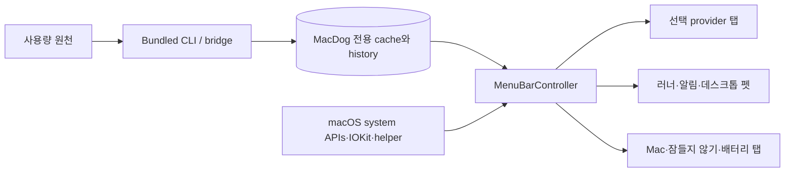

# MacDog 개발자 인수인계

이 문서는 MacDog 저장소에 처음 참여하는 개발자의 시작점입니다. 제품의 현재 상태, 코드 구조,
로컬 개발 환경, 검증과 릴리즈 경계를 한 번에 파악할 수 있도록 세부 문서를 역할별로 나눴습니다.

> 기준 상태: published release는 `v1.9.0`. `v1.9.0` 제품의 설정 visible mode는
> `Codex` 또는 `Grok` 중 사용자가 선택한 **하나의 provider만** 사용량 화면, 러너 속도,
> 알림, refresh 대상으로 사용합니다. Claude source는 남아 있지만 기본 UI에서는 숨깁니다.

## 읽는 순서

| 순서 | 문서 | 읽고 나면 알 수 있는 것 |
| --- | --- | --- |
| 1 | 현재 문서 | 제품 목적, 핵심 용어, 첫날 체크리스트 |
| 2 | [Architecture.md](Architecture.md) | target 의존성, 런타임 데이터 흐름, 저장 경계, 주요 진입점 |
| 3 | [DevelopmentEnvironment.md](DevelopmentEnvironment.md) | 필수 도구, 빌드·테스트·실행 방법, 로컬 파일과 부작용 |
| 4 | [QualityAndRelease.md](QualityAndRelease.md) | 변경별 검증, CI, 보안, 릴리즈 및 중단 조건 |
| 참고 | [../Scripts.md](../Scripts.md) | `script/*.sh` 전체 명령과 영향 범위 |
| 참고 | [../../AGENTS.md](../../AGENTS.md) | 자동화 에이전트와 개발자가 지켜야 할 현재 작업 규칙 |

## 10분 프로젝트 개요

MacDog는 macOS 14 이상에서 동작하는 메뉴바 유틸리티입니다. AI 사용량 확인뿐 아니라 Mac 상태,
잠들지 않기, 배터리 충전 한도, 데스크톱 펫을 한 popover 안에서 제공합니다.

| 질문 | 답 |
| --- | --- |
| 주 사용자는 누구인가? | Codex 또는 Grok 중 하나를 주로 사용하는 macOS 개발자 |
| 핵심 화면은 무엇인가? | 선택 provider 사용량을 보여주는 첫 번째 탭 |
| 기본 사용량 데이터 소스는? | Codex app-server `account/rateLimits/read` |
| Grok 데이터는 어떻게 들어오는가? | bundled `macdog-grok-usage`가 unofficial CLI-proxy `x.ai/billing` 주간 pool을 sanitize한 별도 cache |
| Claude 데이터는 어떻게 들어오는가? | 사용자가 연결한 Claude statusLine event를 bundled bridge가 sanitize한 별도 cache. 기본 UI에서는 숨김 |
| 앱이 인증 파일을 직접 읽는가? | 메뉴바 UI는 읽지 않는다. Codex reset-credit은 조회 직전 memory-only 예외다. Grok billing은 `macdog-grok-usage`만 `~/.grok/auth.json` sibling이다. 유효하면 읽고, 만료/401이면 lock 아래 refresh 후 같은 파일에 다시 쓴다. |
| 주요 언어와 UI 기술은? | Swift 6, SwiftUI, AppKit, 일부 Objective-C bridge |
| 패키지 관리 방식은? | Swift Package Manager. 외부 Swift package dependency는 현재 없다. |
| 기본 배포물은? | `MacDog.app`, `codex-usage`, `macdog-grok-usage`, `macdog-claude-statusline`, optional privileged helper가 포함된 DMG |
| WidgetKit은 기본 배포물인가? | 아니다. source는 보존하지만 `--with-widget` opt-in build 대상이다. |

핵심 설계 원칙은 **조회와 표시의 분리**입니다. Codex 조회는 bundled `codex-usage`가 담당하고,
Grok 조회는 bundled `macdog-grok-usage`가 담당하며, Claude 입력은 bundled
`macdog-claude-statusline`이 정제합니다. 메뉴바 앱은 writer가 만든 MacDog 전용 cache만
읽으므로, 인증·세션·원문 transcript를 UI 프로세스 경계 안으로 가져오지 않습니다.

## 현재 화면

아래 이미지는 저장소가 관리하는 현재 SwiftUI demo snapshot입니다. 실제 사용량과 시스템 값은
사용자 환경에 따라 달라집니다.

<table>
  <tr>
    <th>선택 provider 사용량</th>
    <th>활성 자원</th>
  </tr>
  <tr>
    <td></td>
    <td></td>
  </tr>
  <tr>
    <th>잠들지 않기</th>
    <th>배터리</th>
  </tr>
  <tr>
    <td></td>
    <td></td>
  </tr>
  <tr>
    <th>설정</th>
    <th>데스크톱 펫</th>
  </tr>
  <tr>
    <td></td>
    <td align="center"></td>
  </tr>
</table>

## 먼저 익힐 용어

| 용어 | 이 저장소에서의 의미 |
| --- | --- |
| selected provider | 설정에서 선택한 `Codex` 또는 `Grok` 하나. Claude는 hidden re-enable만. 동시 사용·합산·비교는 지원하지 않음 |
| v1.9.1 selection | 개발 라인에서 Codex/Grok를 하나 또는 둘 다 활성화하고 메인을 지정함. 합산·비교·fallback은 없음 |
| usage window | provider가 제공하는 사용량 구간. Codex는 5시간과 주간 window를 해석함. Grok는 주간만 있음 |
| weekly-only | Codex가 일시적으로 5시간 window를 제공하지 않고 주간 window만 제공하는 정상 partial success |
| remaining | `100 - usedPercent`로 계산한 공식 잔여율 |
| stale/error | 마지막 성공 값을 보존하되 현재 refresh 실패 또는 오래된 상태를 함께 표시하는 상태 |
| app-owned cache | `~/Library/Application Support/MacDog` 아래 MacDog가 소유하는 sanitized JSON |
| reset window history | 완료된 주간 window만 축약하여 보존하는 별도 history 계보 |
| user component | `~/bin/codex-usage`, usage cache LaunchAgent, macOS 로그인 항목처럼 사용자 영역에 설치되는 구성요소 |
| privileged helper | 잠들지 않기 등 제한된 시스템 작업을 수행하는 optional root helper |
| release head | 릴리즈 tag와 artifact가 가리켜야 하는 최종 `origin/main` commit |

## 절대 깨뜨리면 안 되는 계약

1. `~/.codex/auth.json`과 `~/.grok/auth.json`을 일반 진단·UI·문서 작업에서 직접 읽거나 출력하지 않습니다.
2. token, cookie, session, auth header, Claude 원문 transcript/event, Grok billing 원문을 cache·log·fixture에 저장하지 않습니다.
3. Codex 주간 window는 성공 cache의 필수 데이터이며, 5시간 window는 없어도 정상입니다.
4. 없는 5시간 사용량을 `0%`나 이전 값으로 합성하지 않습니다.
5. 같은 `resetsAt` 안에서 주간 그래프의 표시 잔여율이 증가하지 않게 유지합니다.
6. UI는 app-server나 Claude 설정을 직접 읽지 않고 MacDog 전용 cache만 읽습니다.
7. 기본 DMG에 Widget extension을 넣지 않습니다. 실제 Widget UI 검수와 source 검증을 구분합니다.
8. provider 전환 시 이전 provider의 값으로 fallback하지 않습니다.

세부 규칙은 [../../AGENTS.md](../../AGENTS.md), 데이터 흐름은
[Architecture.md](Architecture.md)를 기준으로 합니다.

## 첫날 체크리스트

- [ ] [../../README.md](../../README.md)에서 현재 릴리즈와 사용자 기능을 읽었다.
- [ ] [../../ROADMAP.md](../../ROADMAP.md)에서 현재 완료 범위와 다음 milestone 미정 상태를 확인했다.
- [ ] [Architecture.md](Architecture.md)의 두 provider 흐름과 cache 소유권을 설명할 수 있다.
- [ ] [DevelopmentEnvironment.md](DevelopmentEnvironment.md)에 따라 Xcode·Swift 경로를 확인했다.
- [ ] `swift test --no-parallel` 또는 현재 작업 범위의 focused test를 통과시켰다.
- [ ] `MACDOG_APP_VERSION=9.9.9 ./script/check.sh --no-run`의 범위와 부작용을 알고 있다.
- [ ] 실행·설치·helper·charge limit·release 명령은 별도 승인이나 수동 검수가 필요한지 확인했다.
- [ ] 첫 변경 전에 `git status --short --branch`로 기존 사용자 변경을 확인했다.

## 현재 확인된 것과 미확인인 것

| 구분 | 상태 |
| --- | --- |
| v1.8.0 Codex weekly-only 조회·cache·설치본 UI | published release smoke에서 확인됨 |
| v1.9.0 Claude hide·Grok weekly-only source/test | GitHub Release publish, 설치본 checksum, final-state 확인됨. Finder drag 관찰·popover GUI는 미수행 |
| Codex ↔ Claude ↔ Codex 선택 전환과 user component 복구 | v1.8.0 설치본에서 확인됨. v1.9.0 Codex ↔ Grok 전환 GUI는 미수행 |
| Claude sanitizer·cache·privacy·상태 전이 | fixture와 자동 테스트로 확인됨. 기본 UI에서는 숨김 |
| 실제 유료 Claude 계정의 `rate_limits` live event | 현재 환경에서 미확인. 후보 provider 검증으로 분리 |
| 실제 Grok SuperGrok 주간 billing live event | 미확인. unofficial 경로이며 사용자 승인 전 `~/.grok/auth.json`을 열지 않음 |
| 기본 DMG의 WidgetKit UI | 대상 아님. WidgetKit은 opt-in source/build 경계 |
| Developer ID·notarization 기반 public stable 배포 | 별도 권한과 milestone 승인 전 현재 계획에서 제외 |

미확인 항목을 완료처럼 보고하지 않는 것이 이 프로젝트의 중요한 운영 원칙입니다.

## 첫 변경을 시작할 때

1. `git status --short --branch`로 현재 branch와 변경을 확인합니다.
2. 변경하려는 기능의 source, test, 문서 계약을 [Architecture.md](Architecture.md)에서 찾습니다.
3. 가장 작은 focused test를 먼저 실행하고 변경합니다.
4. [QualityAndRelease.md](QualityAndRelease.md)의 변경 유형별 검증표로 회귀 범위를 닫습니다.
5. 정상 기여는 feature branch와 PR을 사용합니다. `main` 직접 반영은 사용자 또는 maintainer가
   현재 작업에 대해 명시 승인한 예외에서만 수행합니다.
