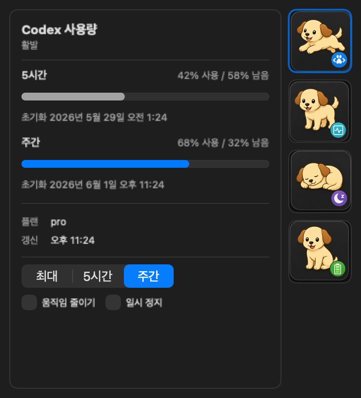
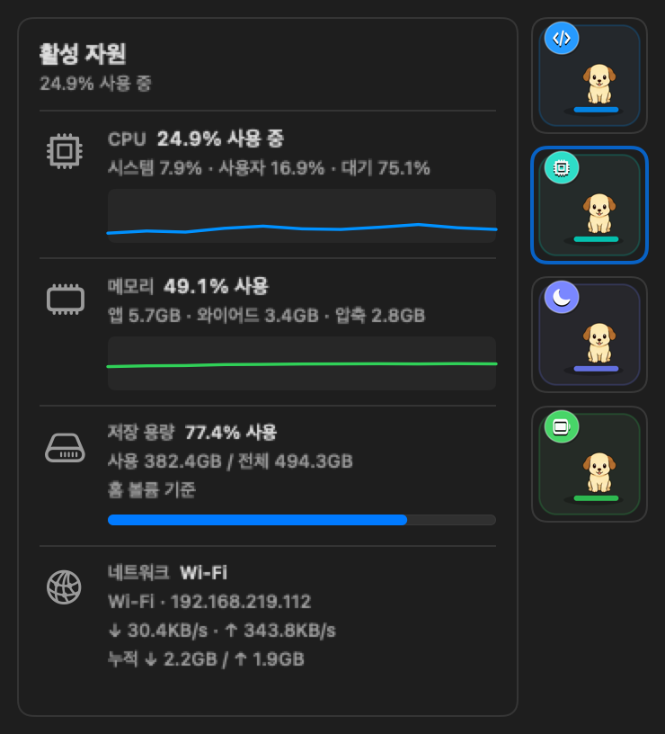
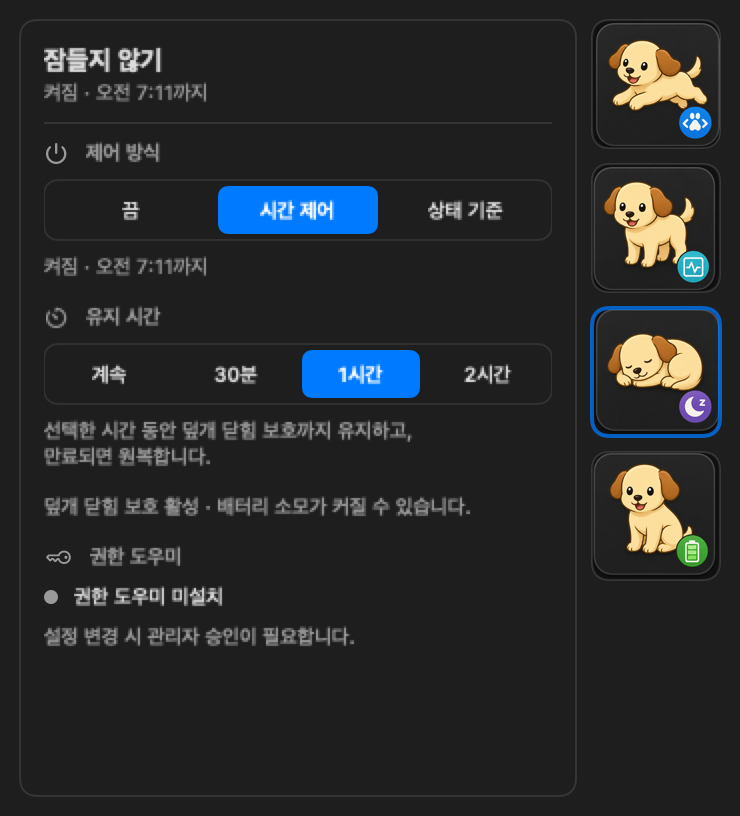
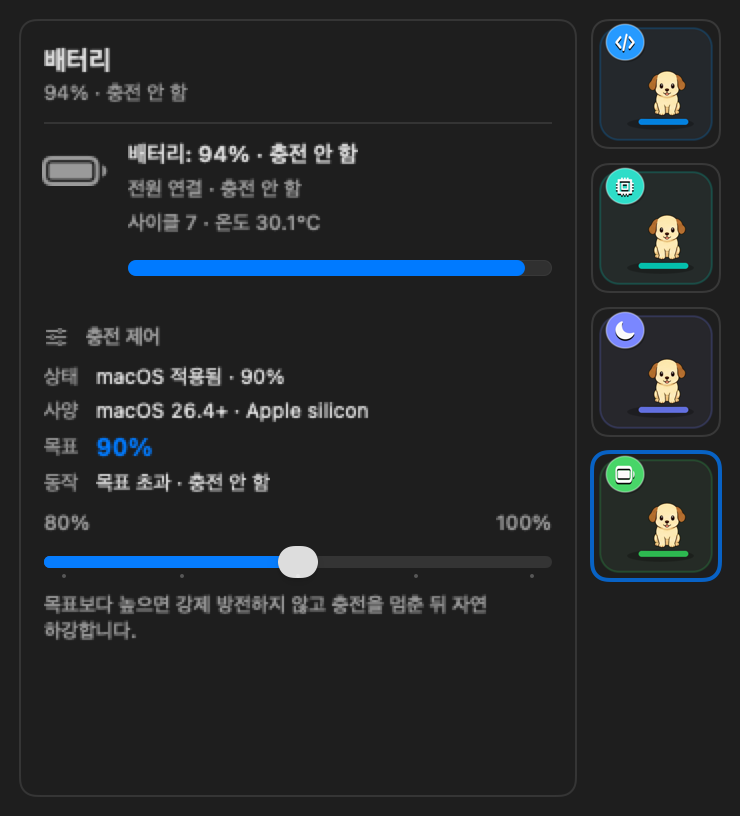

# MacDog

MacDog는 Codex 사용량과 Mac 상태를 메뉴바에서 빠르게 확인하고, 필요할 때 데스크톱 위 강아지 펫으로 띄워두는 macOS 유틸리티다. 현재는 Codex 5시간/주간 사용량, Mac 활성 자원, 잠들지 않기, 배터리 상태를 한 popover 안에서 다룬다.

## 화면

아래 이미지는 README 검수용 fake data로 렌더링한 현재 메뉴바 popover 4개 탭이다. 네 이미지는 같은 크기(`740x816`)로 생성한다.

| Codex 사용량 | 활성 자원 |
| --- | --- |
|  |  |

| 잠들지 않기 | 배터리 |
| --- | --- |
|  |  |

데스크톱 플로팅 펫은 아래 정면 sprite와 같은 스타일의 강아지가 화면 경계 안에서 움직인다.


## 주요 기능

- `codex-usage` CLI: 5시간/주간 사용량, 잔여율, reset 시각, JSON 출력, cache 쓰기
- 메뉴바 앱: 사용량에 따라 움직이는 강아지 러너, 우측 세로 탭 popover, 우클릭 메뉴
- Codex 탭: 5시간/주간 사용률, plan, 갱신 시각, 러너 속도 기준
- 활성 자원 탭: CPU, 메모리, 저장 용량, 네트워크 상태
- 잠들지 않기 탭: 끔/시간 제어/상태 기준, IOKit assertion, 덮개 닫힘 보호
- 배터리 탭: 배터리/전원 상태와 macOS 배터리 설정 연결
- 데스크톱 플로팅 펫: 화면 경계 안 이동, 드래그 위치 저장, 좌클릭 popover, 우클릭 메뉴
- WidgetKit host/extension 패키징 검증과 shared cache 기반 widget 표시
- 설치/삭제 스크립트와 로그인 자동 실행 LaunchAgent

## 빠른 시작

필요 환경:

- macOS 14 이상
- Xcode 또는 Xcode Command Line Tools
- Codex 앱 또는 Codex CLI

전체 검증:

```sh
./script/check.sh
```

앱 빌드 및 실행:

```sh
./script/build_and_run.sh
```

앱을 띄우지 않고 빌드와 테스트만 확인:

```sh
./script/check.sh --no-run
```

runtime smoke:

```sh
./script/build_and_run.sh --verify-runtime 10
./script/build_and_run.sh --verify-floating-pet-runtime 10
```

## CLI

```sh
codex-usage status
codex-usage status --json
codex-usage status --write-cache
codex-usage status --watch 60
codex-usage doctor
```

출력 예시:

```text
Codex usage
5h:     15% used, 85% remaining, resets 2026-05-26 01:27 KST
Weekly: 38% used, 62% remaining, resets 2026-05-31 09:19 KST
Credits: 0
Plan: pro
```

## 설치

설치 스크립트는 release build, 앱 번들 생성, CLI 설치, WidgetKit `.appex` 포함, 로그인/재시작 후 자동 실행 LaunchAgent 등록을 수행한다.

```sh
./script/install.sh
```

설치 전 변경 대상 확인:

```sh
./script/install.sh --dry-run
./script/uninstall.sh --dry-run
./script/install.sh --dry-run --with-helper
./script/uninstall.sh --dry-run --with-helper
./script/install.sh --dry-run --helper-only
./script/uninstall.sh --dry-run --helper-only
```

설치/삭제 후 상태 확인:

```sh
./script/verify_install_state.sh --expect-installed
./script/verify_install_state.sh --expect-uninstalled
./script/verify_privileged_helper_state.sh --expect-installed
./script/verify_privileged_helper_xpc.sh --expect-installed
```

`verify_privileged_helper_xpc.sh`는 새로 빌드된 `dist/MacDog.app`이 있으면 그 실행 파일을 우선 사용하고, 없으면 설치된 앱을 사용한다.
helper 실제 설치 전에는 아래 preflight로 helper bundle, dry-run, 현재 설치 상태, XPC 진단 경로를 먼저 확인한다.

```sh
./script/verify_privileged_helper_preflight.sh --build
```

GitHub Release용 더블클릭 설치 artifact 후보:

```sh
./script/package_release.sh --dry-run
./script/package_release.sh
```

현재 release packaging은 로컬 검증용 `.dmg` 후보를 만들며 Developer ID signing/notarization은 아직 수행하지 않는다.
생성된 `Install MacDog.command`는 앱, CLI, user LaunchAgent를 설치하고 MacDog를 연다.
privileged helper 설치는 별도 승인 flow로 남겨 두며, 공개 배포 전에는 helper 설치 UX와 Gatekeeper 검증을 완료해야 한다.
GitHub Actions의 `Release Candidate` 수동 workflow는 unsigned `.dmg` 후보를 artifact로 만들지만, GitHub Release publication은 아직 자동화하지 않는다.

설치 위치:

```text
~/Applications/MacDog.app
~/Applications/MacDog.app/Contents/PlugIns/MacDogWidgetExtension.appex
~/bin/codex-usage
~/Library/LaunchAgents/com.dhseo.macdog.monitor.plist
~/Library/LaunchAgents/com.dhseo.macdog.usage-cache.plist
```

Privileged helper를 opt-in으로 설치하면 추가로 아래 system 위치를 사용한다.
덮개 닫힘 테스트처럼 앱 재시작을 피해야 하는 경우 `--helper-only`로 helper만 설치/삭제할 수 있다.

```text
/Library/PrivilegedHelperTools/com.dhseo.macdog.helper
/Library/LaunchDaemons/com.dhseo.macdog.helper.plist
```

삭제:

```sh
./script/uninstall.sh
```

## 잠들지 않기

MacDog는 일반 idle sleep 방지를 위해 IOKit power assertion을 사용한다. 덮개 닫힘 보호는 현재 1차 구현으로, 사용자가 관리자 권한을 승인하면 `pmset disablesleep`을 켜고 MacDog가 켠 값만 끄기/시간 만료/조건 해제 시 원복한다.

Privileged helper contract, 설치/삭제 스크립트, helper 우선 제어 코드는 준비되어 있고, 2026-05-28 기준 helper-only 실제 설치, 실제 삭제/재설치, XPC 조회/변경/복구 검증, 최신 설치본 UI에서 `시간 제어`/`끔` 클릭 검증, 짧은 덮개 닫힘 실기 검증, Chrome Remote Desktop 상태의 약 10분 덮개 닫힘 재검증까지 완료했다. 대조군으로 `SleepDisabled=0`에서 덮개를 닫으면 즉시 잠금이 걸리고 검정 화면/비밀번호 화면으로 이어지는 것도 확인했다.

주의: UI 검수 전에는 실행 중인 `/Users/dhseo/Applications/MacDog.app`이 최신 `dist/MacDog.app`와 같은 빌드인지 확인한다. 이전 설치본이 실행 중이면 helper 연동 이전 경로로 비밀번호 프롬프트가 발생할 수 있다.

## 데이터와 보안

- 공식 사용량 기준은 로컬 Codex app-server의 `account/rateLimits/read` 응답이다.
- `primary.windowDurationMins = 300`은 5시간 창, `secondary.windowDurationMins = 10080`은 주간 창으로 해석한다.
- auth token, refresh token, cookie, session material은 읽거나 저장하지 않는다.
- shared cache에는 plan, 사용률, reset 시각, credits, stale/error 상태만 저장한다.

## 프로젝트 구조

```text
Sources/CodexUsageCore/       사용량 조회, 모델, cache, formatter
Sources/CodexUsageCLI/        codex-usage CLI
Sources/MacDog/               macOS 메뉴바 앱과 데스크톱 펫
Sources/MacDogPrivilegedHelper/         앱 번들에 포함되는 helper executable
Sources/MacDogPrivilegedHelperSupport/  helper IPC contract와 허용 명령 정의
Sources/MacDogWidget/         WidgetKit view/provider
Apps/                         Widget host/extension target
Tests/                        core/app 테스트
script/                       빌드, 실행, 설치, 검증 스크립트
Docs/                         보조 설계/검증 문서
Assets/Generated/             생성형 asset과 README 검수 산출물
```

## 문서

- [ROADMAP.md](ROADMAP.md): 개발 로드맵과 MacDog 확장 계획
- [Docs/RunnerBaseline.md](Docs/RunnerBaseline.md): 메뉴바 러너 asset 기준선
- [Docs/WidgetPackaging.md](Docs/WidgetPackaging.md): WidgetKit 패키징 설계와 검증 경계
- [Docs/RuntimeVerification.md](Docs/RuntimeVerification.md): CPU/RSS runtime 검증 절차
- [Docs/ClosedDisplayResearch.md](Docs/ClosedDisplayResearch.md): 덮개 닫힘 보호 조사와 1차 구현 경계
- [Docs/PrivilegedHelperPlan.md](Docs/PrivilegedHelperPlan.md): helper 설치 통합 계획과 1차 contract
- [Docs/ChargeLimitResearch.md](Docs/ChargeLimitResearch.md): Charge Limit 직접 제어 가능성 조사 결과
- [Docs/ReleasePackaging.md](Docs/ReleasePackaging.md): GitHub Release용 더블클릭 설치 artifact 계획
- [AGENTS.md](AGENTS.md): 개발 규칙, 보안 원칙, 검증 체크리스트

## 라이선스

Apache License 2.0. 자세한 내용은 [LICENSE](LICENSE)를 참고한다.
