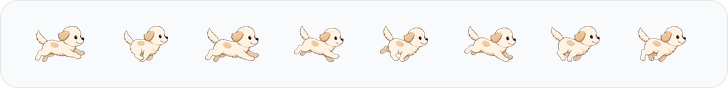
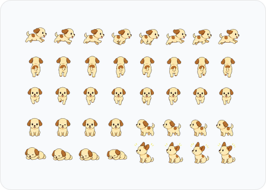

# MacDog

MacDog는 Codex 사용량을 터미널, macOS 메뉴바, 데스크톱 플로팅 펫으로 확인하는 Mac 유틸리티다. 현재는 Codex의 5시간/주간 사용량을 중심으로 동작하며, 장기적으로는 강아지 기반 Mac 유틸리티 앱으로 확장할 계획이다.

작은 강아지 러너 `Codex Pup`이 메뉴바에 상주하고, 사용량이 높아질수록 더 빠르게 움직인다. 필요할 때는 데스크톱 플로팅 펫으로 꺼내 화면 위에서 움직이게 할 수 있다.

## 주요 기능

- `codex-usage` CLI로 5시간/주간 사용량, 남은 비율, reset 시각 확인
- Codex app-server `account/rateLimits/read` 기반 사용량 조회
- shared cache 저장으로 CLI, 메뉴바 앱, 위젯 코드가 같은 snapshot 사용
- WidgetKit host/extension Xcode target과 embedded `.appex` 패키징 검증
- macOS 메뉴바 러너: 사용량 단계에 따라 애니메이션 속도 변경
- 메뉴바 popover: Codex 사용량과 Mac 상태 모듈 전환, 5시간/주간 사용량, plan, credits 표시
- Mac 상태 모듈: CPU load/breakdown, 메모리 상세, 디스크, 네트워크 누적/속도, 로컬 IP, 배터리/전원 세부 상태 표시
- Apple native Charge Limit 지원 감지: macOS 26.4+ / Apple silicon 기준 표시
- 충전 한도 설정 연결: 공개 제어 API 대신 macOS 배터리 설정 화면으로 이동
- 일반 잠자기 방지 모듈: IOKit power assertion으로 항상 금지, 충전 중 금지, 시간 기준 금지, Codex 앱 실행 중 금지 지원
- 자동 잠자기 방지 조건: 전원 연결, Codex 앱 실행, 충전 80% 미만, CPU 80% 이상, 네트워크 100KB/s 이상, 외장/네트워크 볼륨 연결
- 시간 기준 잠자기 방지: 30분/1시간/2시간 세션 preset
- 메뉴바 우클릭 메뉴: 새로고침, 러너 속도 기준, 움직임 줄이기, 애니메이션 일시 정지, 데스크톱 펫 보기, 종료
- 데스크톱 플로팅 펫: 40프레임 sprite, 화면 경계 안 로밍 이동, 드래그 위치 저장, 우클릭 메뉴
- 설치/삭제 스크립트와 로그인 자동 실행 LaunchAgent 지원
- Amphetamine식 고급 trigger 설정과 충전 제어 연구 스파이크는 후속 로드맵에 반영

## 캐릭터 이미지

`Codex Pup`은 MacDog의 기본 강아지 캐릭터다. RunCat의 캐릭터나 asset을 복제하지 않고, 별도로 생성한 sprite를 메뉴바 러너와 데스크톱 플로팅 펫에 사용한다.

### 메뉴바 러너



- 원본 sheet: `Assets/Generated/pup-runner-sheet-source.png` (`2172x724`)
- 문서용 preview: `Assets/Generated/Docs/pup-runner-preview.png`
- 런타임 frame: `Sources/MacDog/Resources/Runner/pup-runner-*.png`
- 구성: `80x48` PNG frame 8장

### 데스크톱 플로팅 펫



- 원본 sheet: `Assets/Generated/pup-desktop-sheet-source-v1.png` (`1536x1024`)
- 정리된 sheet: `Assets/Generated/DesktopPet/v1/pup-desktop-sheet-crop-8x5.png` (`1536x1020`)
- 문서용 preview: `Assets/Generated/Docs/pup-desktop-preview.png`
- 런타임 frame: `Sources/MacDog/Resources/DesktopPet/pup-*.png`
- 구성: `192x204` PNG frame 40장
- pose: `run-right`, `run-up`, `run-down`, `idle-front`, `idle-side`, `alert`, `rest`

## 필요 환경

- macOS 14 이상
- Xcode 또는 Xcode Command Line Tools
- `/usr/bin/xcrun`에서 Swift toolchain 사용 가능
- Codex 앱 또는 Codex CLI가 설치되어 있고 현재 사용자 계정에서 사용량 조회 가능
- 설치 스크립트 사용 시 `~/Applications`, `~/bin`, `~/Library/LaunchAgents` 쓰기 권한
- 검증 스크립트는 기본 macOS 도구를 우선 사용하며, `rg`가 없으면 `grep`으로 대체한다.

## 빠른 시작

전체 검증과 앱 실행:

```sh
./script/check.sh
```

앱을 띄우지 않고 빌드와 테스트만 확인:

```sh
./script/check.sh --no-run
```

메뉴바 앱만 빌드하고 실행:

```sh
./script/build_and_run.sh
```

사용 가능한 실행 옵션:

```sh
./script/build_and_run.sh --help
```

## CLI 사용

```sh
codex-usage status
codex-usage status --json
codex-usage status --write-cache
codex-usage status --watch 60
codex-usage doctor
```

출력 예시:

```text
Codex usage
5h:     15% used, 85% remaining, resets 2026-05-26 01:27 KST
Weekly: 38% used, 62% remaining, resets 2026-05-31 09:19 KST
Credits: 0
Plan: pro
```

## 설치

설치 스크립트는 release build, 앱 번들 생성, CLI 설치, 로그인 시 자동 실행 LaunchAgent 등록을 수행한다.

```sh
./script/install.sh
```

설치 전 변경 대상 확인:

```sh
./script/install.sh --dry-run
./script/uninstall.sh --dry-run
```

설치/삭제 후 상태 확인:

```sh
./script/verify_install_state.sh --expect-installed
./script/verify_install_state.sh --expect-uninstalled
```

설치 위치:

```text
~/Applications/MacDog.app
~/Applications/MacDog.app/Contents/PlugIns/MacDogWidgetExtension.appex
~/bin/codex-usage
~/Library/LaunchAgents/com.dhseo.macdog.monitor.plist
~/Library/LaunchAgents/com.dhseo.macdog.usage-cache.plist
```

삭제:

```sh
./script/uninstall.sh
```

## 프로젝트 구조

```text
Sources/CodexUsageCore/       사용량 조회, 모델, cache, formatter
Sources/CodexUsageCLI/        codex-usage CLI
Sources/MacDog/               macOS 메뉴바 앱과 데스크톱 펫
Sources/MacDogWidget/         WidgetKit용 view/provider 코드
Apps/MacDogWidgetHost/        Widget Extension 검증용 macOS host target
Apps/MacDogWidgetExtension/   Widget Extension target entrypoint와 plist
MacDog.xcodeproj/             WidgetKit host/extension 패키징 검증용 Xcode project
Tests/                        core parser/cache 테스트
script/                       빌드, 실행, 설치, 검증 스크립트
Docs/                         위젯 패키징 등 보조 문서
Assets/Generated/             생성형 sprite 원본과 검수 산출물
```

## 데이터와 보안

- 공식 사용량 기준은 로컬 Codex app-server의 `account/rateLimits/read` 응답이다.
- `primary.windowDurationMins = 300`은 5시간 창, `secondary.windowDurationMins = 10080`은 주간 창으로 해석한다.
- auth token, refresh token, cookie, session material은 읽거나 저장하지 않는다.
- shared cache에는 plan, 사용률, reset 시각, credits, stale/error 상태만 저장한다.

## 현재 상태

- CLI MVP, shared cache, macOS 메뉴바 앱, Codex Pup 러너, 데스크톱 플로팅 펫 MVP, RunCat식 Mac 상태/배터리 상세 모듈, 잠자기 방지 세션/trigger MVP, Apple native Charge Limit 지원 감지와 배터리 설정 연결 구현 완료
- `MacDog` 메뉴바 앱은 SwiftPM executable로 빌드한다.
- WidgetKit은 `MacDog.xcodeproj`의 `MacDogWidgetHost`/`MacDogWidgetExtension` target으로 embedded `.appex` 빌드까지 검증한다.
- 설치 스크립트는 `MacDog.app` 안에 WidgetKit `.appex` 번들을 포함해 배포한다.
- 메뉴바 popover, Mac/Codex 탭, 우클릭 메뉴, 배터리 설정 열기, 데스크톱 플로팅 펫, 위젯 갤러리와 클릭 동작은 사용자 수동 검수 완료.
- 다음 제품 확장은 잠자기 방지 고급 trigger 설정과 충전 제어 연구 스파이크를 우선한다.

## 후속 방향

- 잠자기 방지 고급 trigger: 조건별 threshold 조정, 지정 앱 선택, trigger 종료 조건 정리
- Charge Limit 직접 제어: 공개 API, Shortcuts, 시스템 설정 연동 가능성을 먼저 확인하고, SMC/helper 방식은 별도 연구 스파이크로 분리
- 덮개 닫힘/closed-display mode: 관리자 권한, helper/script, 실패 복구 UX까지 포함해 별도 설계

## 문서

- [ROADMAP.md](ROADMAP.md): 개발 로드맵과 MacDog 확장 계획
- [Docs/WidgetPackaging.md](Docs/WidgetPackaging.md): WidgetKit 패키징 설계와 검증 경계
- [AGENTS.md](AGENTS.md): 개발 규칙, 보안 원칙, 검증 체크리스트

## 라이선스

아직 정하지 않았다.
