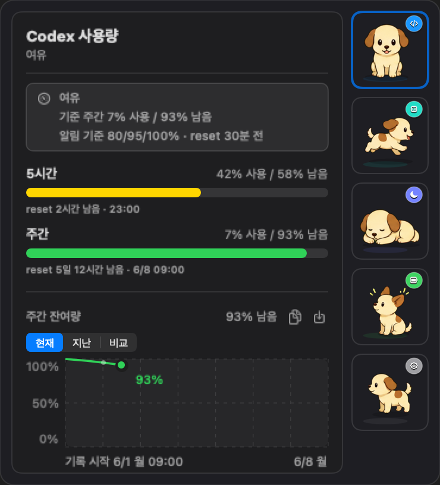
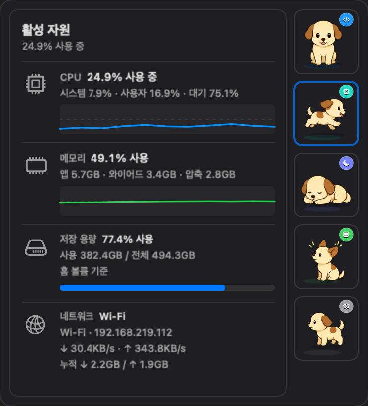
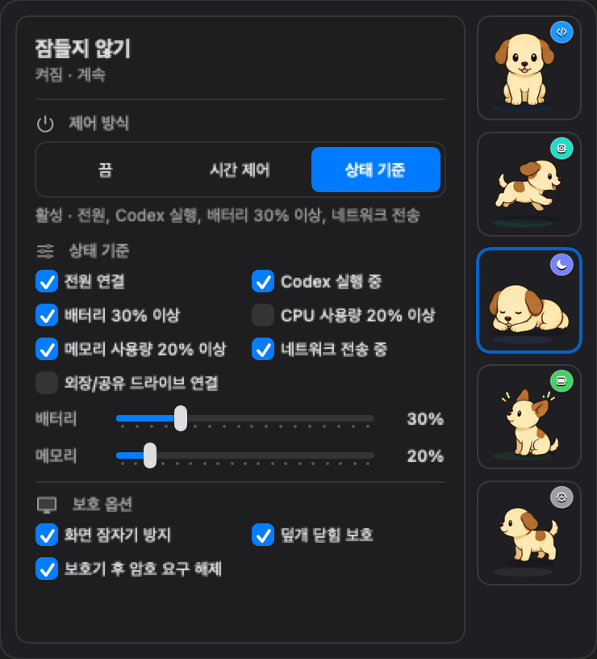
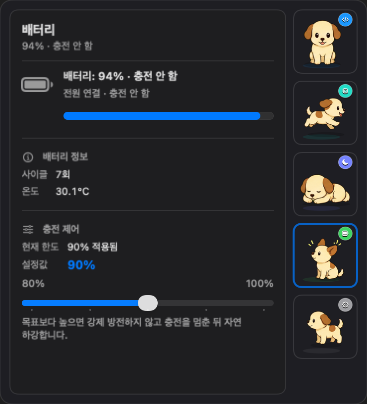
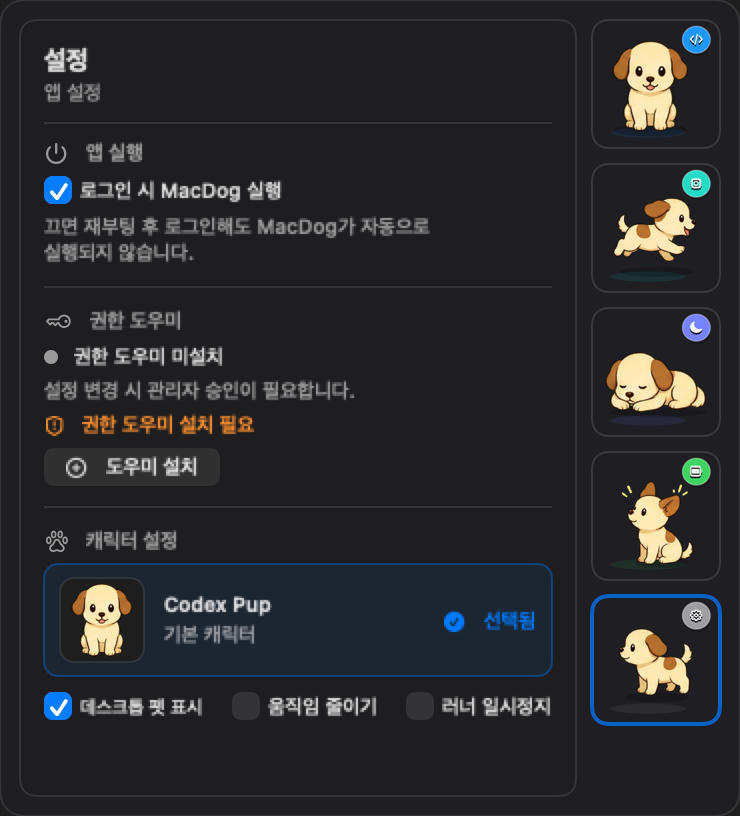

# MacDog

MacDog는 Codex 사용량과 Mac 상태를 메뉴바에서 바로 확인하는 macOS 유틸리티입니다. 작은 강아지 러너가 메뉴바에 상주하고, 클릭하면 Codex 사용량, 현재 자원, 잠들지 않기, 배터리 충전 한도, 앱 설정을 한 popover에서 다룹니다.

기본 캐릭터는 `Codex Pup`입니다. 같은 캐릭터 세트가 메뉴바 러너, 데스크톱 펫, 우측 탭 버튼 이미지에 함께 적용되므로 나중에 캐릭터를 바꿀 때도 한 묶음으로 교체할 수 있습니다.

## 스크린샷

아래 이미지는 현재 SwiftUI popover를 README용 demo snapshot으로 렌더링한 화면입니다. 실제 사용량 값은 사용자 환경에 따라 달라집니다.

<table>
  <tr>
    <th>Codex 사용량</th>
    <th>활성 자원</th>
  </tr>
  <tr>
    <td></td>
    <td></td>
  </tr>
  <tr>
    <th>잠들지 않기</th>
    <th>배터리</th>
  </tr>
  <tr>
    <td></td>
    <td></td>
  </tr>
  <tr>
    <th>설정</th>
    <th>데스크톱 펫</th>
  </tr>
  <tr>
    <td></td>
    <td align="center"></td>
  </tr>
</table>

## 주요 기능

- Codex 사용량: 5시간/주간 사용률, 남은 비율, 초기화 시각, 마지막 갱신 상태를 표시합니다.
- Mac 활성 자원: CPU, 메모리, 저장 용량, 네트워크 상태를 보여주고 현재 자원 탭에서는 1초 단위로 갱신합니다.
- 잠들지 않기: 끔, 시간 제어, 상태 기준 제어를 제공하고 전원 연결, Codex 실행 중, 배터리/CPU/메모리 기준, 네트워크 전송, 외장/공유 드라이브 조건을 OR 조건으로 평가합니다.
- 덮개 닫힘 보호: optional 권한 도우미를 설치하면 최초 승인 이후 앱 UI에서 덮개 닫힘 보호 설정을 바꿀 수 있습니다.
- 배터리 충전 한도: macOS native Charge Limit을 지원하는 Apple silicon Mac에서 80~100% 목표 한도를 읽고 적용합니다.
- 데스크톱 펫: 강아지를 데스크톱 위에 띄우고, 드래그 위치 저장, 좌클릭 popover, 우클릭 메뉴, 상태 반응을 제공합니다.
- 설정: 로그인 시 MacDog 실행, 데스크톱 펫 표시, 움직임 줄이기, 러너 일시 정지, 권한 도우미 설치/제거 상태를 관리합니다.
- WidgetKit: shared cache 기반 small/medium 위젯 코드를 포함합니다. 실제 위젯 갤러리 추가와 클릭 검수는 수동 검증 항목입니다.

## 갱신 주기

- 메뉴바 앱은 app-owned usage cache를 60초마다 다시 읽습니다.
- 캐시가 비어 있거나 사용자가 수동 갱신을 누르면 번들 내부 `codex-usage`를 짧게 실행해 cache를 채웁니다. 실패 후 자동 재시도는 최소 60초 간격으로 제한합니다.
- 개발용 설치 또는 DMG에서 복사한 앱의 첫 실행 마무리 과정이 등록한 usage cache LaunchAgent도 60초마다 `codex-usage status --write-cache --timeout 5`를 실행합니다.
- WidgetKit timeline도 60초 뒤 갱신을 요청합니다. macOS 정책에 따라 실제 위젯 갱신 시각은 지연될 수 있습니다.

## 빠른 시작

필요 환경:

- macOS 14 이상
- Xcode 또는 Xcode Command Line Tools
- Codex 앱 또는 Codex CLI

전체 검증:

```sh
./script/check.sh
```

앱 빌드 및 실행:

```sh
./script/build_and_run.sh
```

앱을 띄우지 않고 빌드와 테스트만 확인:

```sh
./script/check.sh --no-run
```

자주 쓰는 스크립트:

| Script | 용도 |
| --- | --- |
| `./script/check.sh` | 전체 로컬 검증. 기본 모드는 앱 실행까지 포함합니다. |
| `./script/check.sh --no-run` | 앱을 실행하지 않고 테스트, 빌드, packaging gate를 검증합니다. |
| `./script/build_and_run.sh` | 앱 번들을 빌드하고 MacDog를 실행합니다. |
| `./script/install.sh` | 개발용 로컬 설치를 수행합니다. |
| `./script/package_release.sh` | GitHub Release 후보 DMG와 checksum을 만듭니다. |

전체 스크립트 의미와 영향 범위는 [Docs/Scripts.md](Docs/Scripts.md)에 정리되어 있습니다.

## CLI

설치 후 터미널에서는 `codex-usage`로 현재 Codex 사용량을 확인할 수 있습니다.

```sh
codex-usage status
codex-usage status --json
codex-usage status --write-cache
codex-usage status --write-cache --mirror-cache
codex-usage status --watch 60
codex-usage doctor
```

`status`는 5시간/주간 사용률, 남은 비율, 초기화 시각, plan, 갱신 상태를 출력합니다. JSON 출력은 앱, 위젯, cache writer가 의존하는 계약이므로 breaking change를 만들지 않습니다.

## 로컬 설치

개발용 설치 스크립트는 release build를 만들고 `~/Applications/MacDog.app`에 설치합니다. 앱 번들 내부 `codex-usage`를 `~/bin/codex-usage` symlink로 연결하고, usage cache LaunchAgent를 등록합니다. 로그인 자동 실행은 앱이 macOS 로그인 항목으로 직접 등록합니다.

```sh
./script/install.sh
```

설치 전 변경 대상 확인:

```sh
./script/install.sh --dry-run
./script/uninstall.sh --dry-run
./script/install.sh --dry-run --with-helper
./script/uninstall.sh --dry-run --with-helper
```

설치 상태 확인:

```sh
./script/verify_install_state.sh --expect-installed
./script/verify_install_state.sh --expect-current-dist
./script/verify_privileged_helper_state.sh --expect-installed
./script/verify_privileged_helper_xpc.sh --expect-installed
./script/verify_charge_limit.sh --read
```

권한 도우미는 앱 설정 탭에서 설치/제거하는 흐름을 기본으로 합니다. 개발용 `--with-helper`/`--helper-only`는 터미널에서 직접 실행할 때 `sudo`를 사용하며, Codex 같은 비대화형 실행에서는 `osascript` 승인창을 자동으로 띄우지 않습니다.

삭제:

```sh
./script/uninstall.sh
./script/uninstall.sh --reset-preferences
```

기본 삭제는 앱, CLI symlink, user LaunchAgent, usage cache 파일을 제거하고 UserDefaults와 optional 권한 도우미는 유지합니다. `--reset-preferences`는 로그인 자동 실행과 잠들지 않기 관련 MacDog 설정을 함께 초기화합니다.

## 릴리즈 패키지

GitHub Release용 로컬 후보는 `.dmg`와 checksum을 만듭니다.

```sh
./script/package_release.sh --dry-run
./script/package_release.sh
```

릴리즈 DMG의 목표 UX는 Finder에서 `MacDog.app`을 `Applications`로 드래그하는 표준 macOS 설치 방식입니다. DMG는 드래그 앤 드롭 배경 화면을 포함하고, 앱을 `Applications`에서 처음 실행하면 MacDog가 터미널용 `~/bin/codex-usage` symlink와 usage cache LaunchAgent를 사용자 영역에 마무리 설치합니다. 로그인 자동 실행은 macOS 로그인 항목으로 등록합니다. 첫 실행 후에는 설치 디스크와 다운로드한 설치 파일 정리를 물어봅니다. optional 권한 도우미가 없으면 첫 실행에서 설치 여부를 묻고, 사용자가 동의하면 MacDog 이름의 관리자 승인창을 엽니다.

현재 공개 배포 전 gate:

- Developer ID signing
- hardened runtime
- notarization
- stapling
- Gatekeeper 검증
- 깨끗한 사용자 환경에서 DMG 설치/제거 검수

세부 배포 경계는 [Docs/ReleasePackaging.md](Docs/ReleasePackaging.md)에 정리합니다.

## GitHub 릴리즈 준비

레포에는 PR 기반 운영을 위한 기본 준비가 포함되어 있습니다.

- PR/`main` push 검증 workflow: `.github/workflows/ci.yml`
- public repo guardrails workflow: `.github/workflows/public-repo-guardrails.yml`
- 전체 파일 기본 reviewer: `.github/CODEOWNERS`
- PR 검증 템플릿: `.github/pull_request_template.md`
- 취약점 보고 기준: `SECURITY.md`
- public repo 정책 파일: `config/public_repo_policy.json`
- public/server 설정 적용 스크립트: `script/configure_github_public_repo_settings.sh`
- branch protection 적용 스크립트: `script/configure_github_branch_protection.sh`

`main` 직접 push 차단과 PR 필수 규칙은 GitHub repository 설정입니다. GitHub Free private repository에서는 GitHub가 branch protection API를 거절할 수 있으므로, public 전환 또는 branch protection 가능 plan 조건을 먼저 충족한 뒤 `static-gates`와 `guardrails` required checks를 적용합니다.

## 잠들지 않기

MacDog는 일반 idle sleep 방지를 위해 IOKit power assertion을 사용합니다. 덮개 닫힘 보호는 `pmset disablesleep` 기반이며 관리자 승인이 필요합니다.

권한 도우미가 설치되어 있으면 MacDog가 덮개 닫힘 보호 설정 변경을 대신 처리합니다. 권한 도우미가 설치된 상태에서 연결이 실패하면 예전 관리자 승인창으로 조용히 우회하지 않고 실패 상태를 표시합니다.

화면 또는 덮개 닫힘 후 macOS 로그인창이 뜨는지는 Lock Screen의 암호 요구 설정도 영향을 줍니다. 최신 macOS에서 실제 Lock Screen 상태가 `immediate`이면 예전 `com.apple.screensaver` 값만으로는 해제되지 않으므로, MacDog는 이 상태를 감지해 오류로 표시합니다.

2026-05-29 기준 확인된 실사용 결과:

- `SleepDisabled=1` 상태에서 덮개 닫힘 후 슬립/락으로 떨어지지 않음
- 대조군 `SleepDisabled=0`에서는 덮개를 닫자 즉시 잠금과 검정 화면이 발생
- Chrome Remote Desktop으로 제어 중인 MacBook에서도 장시간 덮개 닫힘 유지 확인

## 배터리 충전 한도

macOS 26.4 이상 Apple silicon Mac에서는 native Charge Limit 값을 80~100% 범위로 읽고 적용합니다. 이 기능은 배터리를 즉시 강제 방전시키는 기능이 아니라, macOS 충전 상한을 적용해 자연 하강/유지를 맡기는 방식입니다.

2026-05-29 기준 개발 Mac에서는 UI에서 목표 한도 `90%`를 적용했고, AC 연결 상태의 배터리가 `95%`에서 `90%`로 내려가는 것을 확인했습니다.

## 데이터와 개인정보

- Codex 사용량 기준은 로컬 Codex app-server의 `account/rateLimits/read` 응답입니다.
- `primary.windowDurationMins = 300`은 5시간 창, `secondary.windowDurationMins = 10080`은 주간 창으로 해석합니다.
- auth token, refresh token, cookie, session material은 읽거나 저장하지 않습니다.
- cache에는 plan, 사용률, 초기화 시각, stale/error 상태 같은 표시 정보만 저장합니다.
- 메뉴바 앱 UI process는 auth token이나 raw app-server 응답을 다루지 않습니다. Codex 사용량이 비어 있으면 번들 내부 `codex-usage`를 짧은 cache writer로 실행한 뒤 app-owned cache를 다시 읽습니다.

## 프로젝트 구조

```text
Sources/CodexUsageCore/                 사용량 조회, 모델, cache, formatter
Sources/CodexUsageCLI/                  codex-usage CLI
Sources/MacDog/                         macOS 메뉴바 앱과 데스크톱 펫
Sources/MacDogPrivilegedHelper/         권한 도우미 executable
Sources/MacDogPrivilegedHelperSupport/  helper IPC contract와 허용 명령 정의
Sources/MacDogWidget/                   WidgetKit view/provider
Apps/                                   Widget host/extension target
Tests/                                  core/app/helper 테스트
script/                                 빌드, 실행, 설치, 검증 스크립트
Docs/                                   보조 설계/검증 문서
```

## 문서

- [ROADMAP.md](ROADMAP.md): 개발 로드맵과 잔여 이슈
- [Docs/RunnerBaseline.md](Docs/RunnerBaseline.md): 메뉴바 러너 asset 기준선
- [Docs/WidgetPackaging.md](Docs/WidgetPackaging.md): WidgetKit 패키징 경계
- [Docs/RuntimeVerification.md](Docs/RuntimeVerification.md): CPU/RSS runtime 검증 절차
- [Docs/Scripts.md](Docs/Scripts.md): `script/*.sh` 용도와 영향 범위
- [Docs/ClosedDisplayResearch.md](Docs/ClosedDisplayResearch.md): 덮개 닫힘 보호 조사와 검증 결과
- [Docs/PrivilegedHelperPlan.md](Docs/PrivilegedHelperPlan.md): 권한 도우미 설치와 IPC contract
- [Docs/ChargeLimitResearch.md](Docs/ChargeLimitResearch.md): Charge Limit 연동 조사 결과
- [Docs/ReleasePackaging.md](Docs/ReleasePackaging.md): GitHub Release와 DMG 배포 계획
- [Docs/GitHubReleaseChecklist.md](Docs/GitHubReleaseChecklist.md): PR 보호 규칙과 GitHub Release 체크리스트
- [AGENTS.md](AGENTS.md): 개발 규칙, 보안 원칙, 검증 체크리스트
- [CONTRIBUTING.md](CONTRIBUTING.md): PR 작성과 검증 기준

## 라이선스

Apache License 2.0. 자세한 내용은 [LICENSE](LICENSE)를 참고합니다.
