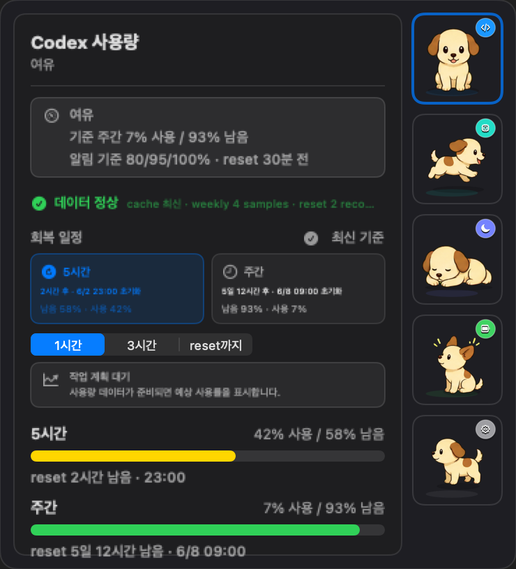
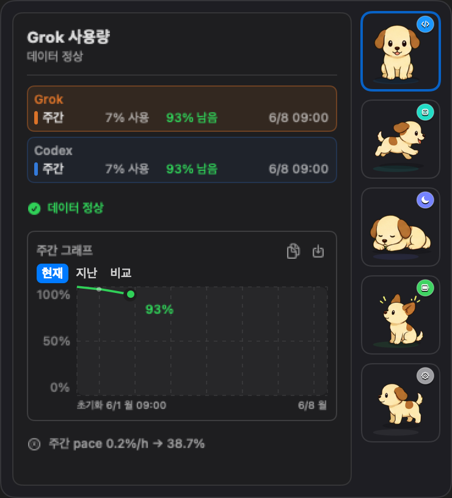
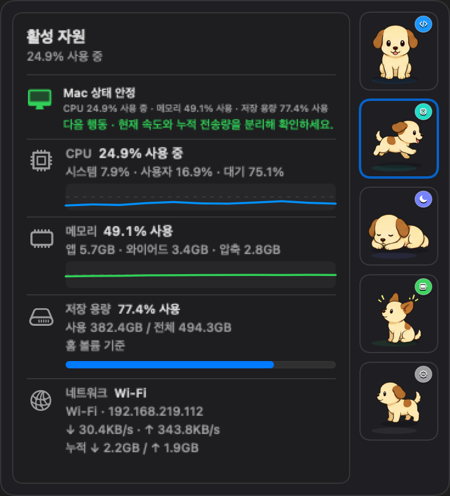
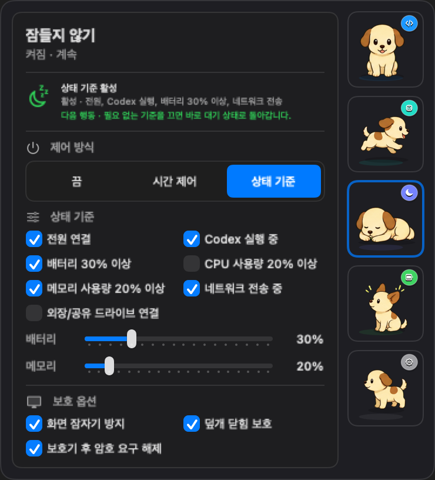
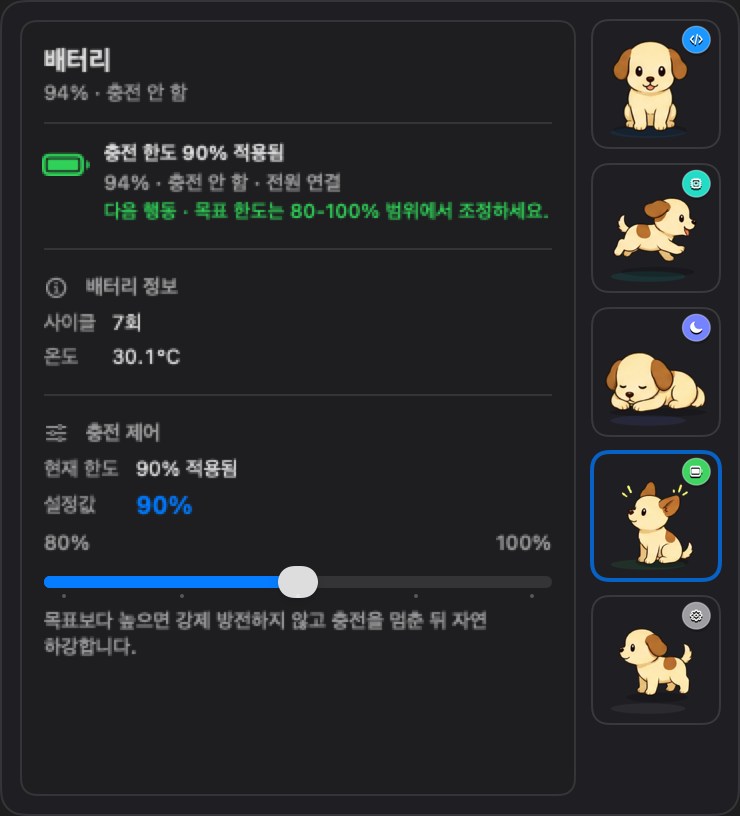
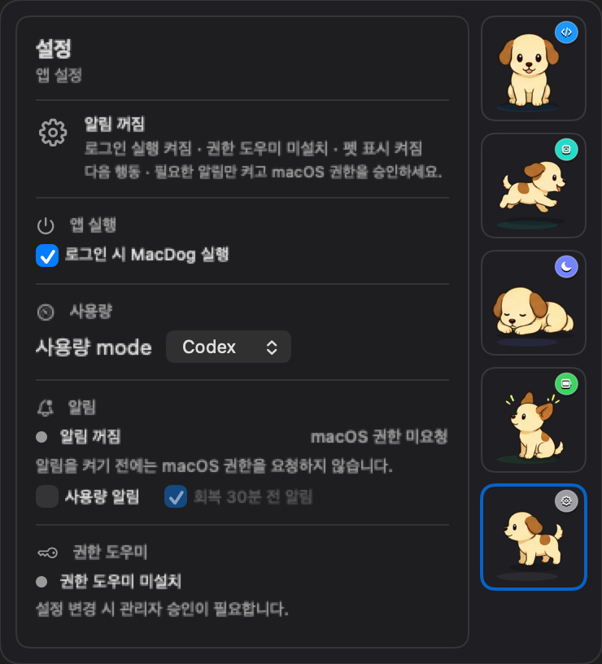

# MacDog

MacDog는 선택한 하나의 AI provider 사용량과 Mac 상태를 메뉴바에서 바로 확인하는 macOS
유틸리티입니다. `1.9.0` 제품의 설정 visible mode는 `Codex`와 `Grok`만 보여 주고 Claude
source는 남긴 채 숨깁니다. 두 provider 동시 사용, 합산, 비교는 고려하지 않습니다. 현재
GitHub에 published된 설치본은 아래 [현재 릴리즈](#현재-릴리즈)를 따릅니다.

기본 캐릭터는 `Codex Pup`입니다. 같은 캐릭터 세트가 메뉴바 러너, 데스크톱 펫, 우측 탭 버튼 이미지에 함께 적용되므로 나중에 캐릭터를 바꿀 때도 한 묶음으로 교체할 수 있습니다.

## 현재 릴리즈

현재 GitHub Release는 [v1.9.0](https://github.com/dhseo90/MacDog/releases/tag/v1.9.0)입니다.

- Published release head: signed `v1.9.0` tag target `b7072003830798bb1603768c4efb0b41409100f6`
- GitHub tag verification: `Verified`
- Published asset: `MacDog-1.9.0.dmg`, `MacDog-1.9.0.dmg.sha256`
- Published DMG SHA-256: `471e10a976cafd469a445af0391e21804cec43bb64f595508f2988935af87011`
- 상태: unsigned/ad-hoc signed GitHub Release입니다. Apple Developer Program 조건이 필요한 public stable 배포는 현재 구현 계획에서 제외하고 별도 milestone에서 다룹니다.
- 확인된 smoke: published DMG 재다운로드 checksum과 `hdiutil verify`를 통과했습니다.
  payload 버전은 `1.9.0`이며 `macdog-grok-usage`를 포함합니다.
- Finder drag-and-drop 설치, `/Applications/MacDog.app` executable checksum 일치,
  설치본 GUI, cache LaunchAgent, `verify_release_final_state.sh --version 1.9.0`은
  미수행입니다. published DMG Finder 창은 열었고 설치는 사용자가 직접 합니다.
- 공식 live Grok billing smoke 체크리스트 전체는 미수행으로 분리합니다.

설정 picker의 보이는 값은 `Codex`와 `Grok`뿐입니다. Claude는 hidden/debug re-enable만
남깁니다. Grok는 SuperGrok / Grok Build 공유 주간 pool만 표시하며 5시간 window는 `현재
제공되지 않음`입니다. Extra Usage Credits를 Codex 초기화권처럼 보여 주지 않습니다. 설정
탭 `날짜 기준` 기본값은 자정이고, 리셋 시각 24시간 칸은 옵션입니다. `uninstall.sh`는 Grok
cache/history/lock과 Grok LaunchAgent를 Codex/Claude와 같이 제거합니다.

미수행으로 분리하는 항목:

- Finder drag-and-drop 설치와 release final-state
- 공식 live Grok billing smoke 체크리스트 전체
- 설정 dropdown을 연 상태의 PNG. 아래 설정 snapshot은 닫힌 picker입니다

설정 탭 공식 snapshot은 demo renderer가 닫힌 picker를 그린 이미지입니다. 선택된 값은
`Codex`이며, dropdown 안의 `Grok` 항목은 그 PNG에서 보이지 않습니다. Grok 탭 snapshot은
별도 이미지로 둡니다. 이 이미지를 실제 GUI 검수 완료로 쓰지 않습니다.

세부 범위는 [Docs/V190GrokUsageAndClaudeHide.md](Docs/V190GrokUsageAndClaudeHide.md),
릴리즈 체크리스트는 [Docs/V190ReleaseReadiness.md](Docs/V190ReleaseReadiness.md)를
기준으로 합니다.

이전 published release는 [v1.8.0](https://github.com/dhseo90/MacDog/releases/tag/v1.8.0)입니다.
v1.8.0 release head는 `14d716a88ea10a77344a4f9aa3651c23b1160f8c`이고 published asset는
`MacDog-1.8.0.dmg`입니다.

## 화면

아래 이미지는 현재 SwiftUI popover 구조를 README용 demo snapshot으로 렌더링한 공식 이미지입니다. 실제 사용량 값과 시스템 상태는 사용자 환경에 따라 달라집니다.

<table>
  <tr>
    <th>Codex 사용량</th>
    <th>Grok 사용량</th>
  </tr>
  <tr>
    <td></td>
    <td></td>
  </tr>
  <tr>
    <th>활성 자원</th>
    <th>잠들지 않기</th>
  </tr>
  <tr>
    <td></td>
    <td></td>
  </tr>
  <tr>
    <th>배터리</th>
    <th>설정</th>
  </tr>
  <tr>
    <td></td>
    <td></td>
  </tr>
  <tr>
    <th>데스크톱 펫</th>
    <th></th>
  </tr>
  <tr>
    <td align="center"></td>
    <td></td>
  </tr>
</table>

## 앱 구조

MacDog는 기본 DMG에서 메뉴바 앱과 CLI를 함께 제공합니다. WidgetKit 코드는 보존하지만 기본 앱/DMG에는 포함하지 않고, `--with-widget` opt-in build에서만 검수합니다.

| 영역 | 역할 |
| --- | --- |
| 메뉴바 러너 | 선택 provider 하나의 사용량 위험도를 표시합니다. |
| 사용량 탭 | 선택 provider의 현재 제공되는 단기/장기 window 사용률, 잔여율, reset, history와 pace를 표시합니다. Codex 5시간 window가 없으면 주간 정보는 계속 갱신합니다. Grok는 주간 window만 있고 5시간은 `현재 제공되지 않음`입니다. |
| 활성 자원 탭 | CPU, 메모리, 저장 용량, 네트워크 상태를 1초 단위로 갱신합니다. |
| 잠들지 않기 탭 | 끔, 시간 제어, 상태 기준 제어와 보호 옵션을 관리합니다. |
| 배터리 탭 | macOS native Charge Limit 지원 환경에서 80-100% 목표 한도를 읽고 적용합니다. |
| 설정 탭 | `사용량 mode`(`Codex`/`Grok`)와 주간 그래프 `날짜 기준`(자정/리셋 시각), 알림, 로그인 실행, 데스크톱 펫, 권한 도우미 상태를 관리합니다. |
| 첫 실행 마무리 | `/Applications/MacDog.app` 첫 실행 시 `~/bin/codex-usage`, 선택 mode 전용 usage cache LaunchAgent(`codex-usage` 또는 `macdog-grok-usage`), macOS 로그인 항목을 사용자 영역에 맞게 설치/복구합니다. |

## 설치

사용자 설치는 GitHub Release의 DMG를 기준으로 합니다.

1. [v1.9.0 Release](https://github.com/dhseo90/MacDog/releases/tag/v1.9.0)에서 `MacDog-1.9.0.dmg`를 내려받습니다.
2. DMG를 Finder에서 엽니다.
3. 보이는 `MacDog.app`을 `Applications`로 드래그합니다.
4. `Applications`에서 MacDog를 실행합니다.

Finder 복사 자체는 앱을 실행하지 않습니다. `/Applications/MacDog.app` 첫 실행 시 MacDog가 터미널용 `~/bin/codex-usage` symlink, 선택 mode 전용 usage cache LaunchAgent, macOS 로그인 항목을 사용자 설정에 맞게 마무리합니다. Grok mode에서는 `macdog-grok-usage` LaunchAgent를 쓰고 Codex cache LaunchAgent는 제거합니다.

설치 검수 원칙:

- `script/install.sh`, 직접 복사, `hdiutil` mount 후 파일 복사, 앱 번들 직접 교체는 사용자 설치 검수로 기록하지 않습니다.
- 실제 DMG Finder 창에서 `MacDog.app`을 `Applications`로 drag-and-drop하지 못했으면 설치 검수는 미수행으로 기록합니다.
- release smoke 종료 시 `./script/cleanup_release_smoke_state.sh --apply`와 `./script/verify_release_final_state.sh --version <version>`으로 Finder 검색 중복과 stale LaunchAgent를 확인합니다.

## 주요 기능

- Codex 사용량: 5시간/주간 사용률, 남은 비율, reset까지 남은 시간, 초기화 시각, 마지막 갱신 상태,
  pace 예측, 현재/지난/비교 그래프를 표시합니다. 5시간 window가 일시 미제공되면 이를 `현재
  제공되지 않음`으로 표시하고 주간 cache/history, runner, 알림은 계속 갱신합니다.
- Codex 초기화권: 사용자 보유 초기화권 장수와, 제공 가능한 경우 각 장의 유효기간을 Codex 탭에서 확인합니다.
- Codex 그래프 공유: 화면에 보이는 그래프를 PNG로 복사하거나 저장합니다. PNG에는 auth/session material, raw app-server 응답, raw log line, local path metadata를 넣지 않습니다.
- Codex 페이스메이커: weekly window 시작부터 24시간 day slot을 나누고 일일 목표 약 14.3%,
  현재 day 사용량과 누적 페이스를 계산합니다. 가격 플랜 적합성을 예측하지 않습니다.
- Codex 사용량 알림: `UserNotifications` 기반 로컬 알림으로 80%, 95%, 한도 도달, reset 30분 전 이벤트를 알려줍니다.
- Grok 사용량: SuperGrok / Grok Build 공유 주간 pool의 사용률, 잔여율(`100 - usedPercent`),
  제공되는 경우 reset, stale/error, 현재/지난/비교 그래프와 주간 pace를 표시합니다. 5시간
  window는 없고 `현재 제공되지 않음`입니다. Extra Usage Credits와 console prepaid는 표시하지
  않습니다. live billing 조회는 미수행으로 분리합니다.
- Claude backend: 공식 status line JSON의 optional `rate_limits.five_hour`/`seven_day`를 sanitize해
  별도 cache/history에 저장합니다. v1.9.0 기본 UI에서는 숨기고 hidden re-enable이 켜진 경우에만
  선택 mode로 남깁니다. 실제 구독 live 검증은 미수행으로 분리합니다.
- 선택 provider graph: current/past/compare와 pace를 유지하되 선택한 provider 하나만 평가합니다.
  Claude·Grok reset credit은 만들지 않습니다.
- Mac 활성 자원: CPU, 메모리, 저장 용량, 네트워크 상태를 보여주고 현재 자원 탭에서는 1초 단위로 갱신합니다.
- 잠들지 않기: 끔, 시간 제어, 상태 기준 제어를 제공하고 전원 연결, 선택 provider 실행 중, 배터리/CPU/메모리 기준, 네트워크 전송, 외장/공유 드라이브 조건을 OR 조건으로 평가합니다.
- 덮개 닫힘 보호: optional 권한 도우미를 설치하면 최초 승인 이후 앱 UI에서 덮개 닫힘 보호 설정을 바꿀 수 있습니다.
- 배터리 충전 한도: macOS native Charge Limit을 지원하는 Apple silicon Mac에서 80-100% 목표 한도를 읽고 적용합니다.
- 데스크톱 펫: 강아지를 데스크톱 위에 띄우고, 드래그 위치 저장, 좌클릭 popover, 우클릭 메뉴, 상태 반응을 제공합니다.
- 설정: 로그인 시 실행, 데스크톱 펫, 움직임 줄이기, 러너 일시 정지, 권한 도우미와 기존
  사용량 알림 opt-in을 관리합니다. `Codex` 또는 `Grok` 중 하나를 고르는 `사용량 mode`와
  주간 그래프 `날짜 기준`(기본 자정, 옵션 리셋 시각)을 둡니다. 별도 플랜 전환·Claude Preview
  설정은 없습니다. Claude는 기본 picker에 보이지 않습니다.
- Claude 연결 경계: 기존 `~/.claude/settings.json`이나 auth store를 앱이 자동으로 읽거나 수정하지
  않습니다. Claude mode의 cache 없음 empty state에서 수동 연결 command만 제공하고 기존 status
  line을 자동 덮어쓰지 않습니다.

## 갱신 주기

- 메뉴바 앱은 app-owned usage cache를 60초마다 다시 읽습니다.
- 캐시가 비어 있거나 사용자가 수동 갱신을 누르면 번들 내부 `codex-usage`를 짧게 실행해 cache를 채웁니다. 실패 후 자동 재시도는 최소 60초 간격으로 제한합니다.
- Codex mode에서는 첫 실행 마무리가 usage cache LaunchAgent를 등록해 60초마다
  `codex-usage status --write-cache --timeout 15`를 실행합니다. Grok mode에서는
  `macdog-grok-usage status --write-cache` LaunchAgent를 등록하고 Codex LaunchAgent를
  unload·제거합니다. Codex mode로 돌아오면 Grok LaunchAgent를 제거하고 Codex writer를
  다시 설치합니다. hidden Claude mode는 Codex/Grok writer를 돌리지 않습니다.
- 성공한 주간 잔여량은 `~/Library/Application Support/MacDog/usage-weekly-history.json`에 샘플링되어 Codex 탭 그래프에 쓰입니다.
- 성공한 5시간 사용률은 별도 `usage-five-hour-history.json`에 13주 보존됩니다. v1.8.0에서
  `planEpochID` 신규 기록·계산 의존을 제거하고 단기 pace에 재사용합니다. 기존 파일의 legacy field는
  decode 호환만 유지합니다. 5시간 window가 없을 때는 새 sample을 합성하지 않고 기존 history를
  보존하며, window가 복구되면 자동으로 sample과 pace 갱신을 재개합니다.
- WidgetKit opt-in build에서만 `--mirror-cache`를 추가해 shared cache를 함께 갱신합니다.
- 성공한 Grok 주간 잔여량은 `~/Library/Application Support/MacDog/grok-usage-history.json`에
  샘플링됩니다. Grok cache는 `grok-usage.json`이며 Codex `usage.json`과 섞지 않습니다.
- hidden Claude mode는 polling/manual refresh를 만들지 않습니다. `macdog-claude-statusline`이 새
  Claude 응답 event를 받을 때 `claude-usage.json`과 `claude-usage-history.json`을 갱신하며,
  마지막 정상 사용량 관측 후 15분이면 stale로 표시합니다.

## v1.8.0 검증과 릴리즈 경계

v1.8.0 검증은 v1.7 plan transition 제거, 1/7 day 페이스메이커, Codex weekly-only partial cache/UI와
5시간 자동 복구, 5시간 pace와 v1.8 Claude
sanitizer/cache/privacy backend, 단일 provider preference migration과 설정·1번 탭·runner·알림·Codex
live refresh routing, Claude 잔여율·cache 없음 UI와 bundle/install/final-state bridge gate를 확인합니다.

```sh
./script/verify_v170_codex_pacemaker_contract.sh --self-test
./script/verify_v180_selected_provider_contract.sh --self-test
MACDOG_APP_VERSION=1.8.0 ./script/check.sh --no-run
```

2026-07-13 기준 전체 `swift test --no-parallel` 464개 통과(명시적 opt-in 4개 skip), Xcode Debug
no-sign build와 `check.sh --no-run`이 통과했습니다. Release Candidate run `29253650552`와
Draft Release run `29254330686`도 release head `14d716a88ea10a77344a4f9aa3651c23b1160f8c`
기준으로 통과했습니다. published DMG 설치와 final-state 결과는
[Docs/V180ReleaseReadiness.md](Docs/V180ReleaseReadiness.md)에 기록합니다.

자동 검증은 Claude 설정, auth store, Keychain, transcript, network, GUI를 건드리지 않습니다.
현재 로컬 Claude Code `2.1.39`에서는 실제 구독 `rate_limits` event를 확인하지 못했습니다.
따라서 `Claude backend·selected-provider routing·표시·release bridge gate 자동 검증 완료 /
GUI 검수 전 / live Claude 구독 검수 미수행`으로 구분하며,
실제 5시간/7일 값과 reset 경계를 검증 완료로 주장하지 않습니다.

## v1.9.0 검증과 릴리즈 경계

v1.9.0 검증은 Claude hide, Grok weekly-only cache/UI, 3분기 routing, no-fallback, token
미저장과 문서 용어를 확인합니다. published `v1.8.0` 완료 증거와 `verify_v180_*`는 덮어쓰지
않습니다.

```sh
./script/verify_v180_selected_provider_contract.sh --self-test
./script/verify_v190_selected_provider_contract.sh --self-test
./script/verify_v190_release_readiness.sh --self-test
MACDOG_APP_VERSION=1.9.0 ./script/check.sh --no-run
```

자동 검증은 `~/.grok/auth.json`, live billing, GUI 앱, 설치, LaunchAgent 등록을 하지 않습니다.
Grok live billing, 실제 앱 UI, published DMG Finder 설치는 `미수행`으로 남깁니다. 결과는
[Docs/V190ReleaseReadiness.md](Docs/V190ReleaseReadiness.md)에 기록합니다.

## 알림 경계

v1.3.0 알림은 Apple Developer 계정 필요 없이 가능한 `UserNotifications` 기반 로컬 알림입니다. MacDog는 app-owned usage cache를 읽어 80%, 95%, 한도 도달, reset 30분 전 이벤트를 판단하고, raw app-server 응답이나 auth/session material은 다루지 않습니다.

알림은 기본 꺼짐이며 사용자가 설정 탭에서 켜고 macOS 알림 권한을 승인한 뒤에만 발송합니다. 테스트 알림 버튼은 v1.3.0 범위에 넣지 않습니다. `codex-usage status --json`을 포함한 JSON/cache/app-server 계약은 변경하지 않습니다. Apple Developer 계정이 필요한 기능명은 v1.3.0 완료 조건과 후속 이슈에 나열하지 않습니다.

## CLI

설치 후 터미널에서는 `codex-usage`로 현재 Codex 사용량을 확인할 수 있습니다.

```sh
codex-usage status
codex-usage status --json
codex-usage status --write-cache
codex-usage status --write-cache --mirror-cache
codex-usage status --watch 60
codex-usage doctor
```

`status`는 현재 제공되는 5시간/주간 사용률, 남은 비율, 초기화 시각, plan, 사용자 초기화권 summary,
갱신 상태를 출력합니다. 5시간 window가 없으면 `5h: unavailable`로 출력하되 주간 조회는 성공으로
처리합니다. plan은 app-server 응답의 raw `planType`만 표시하며, `Plus`/`Pro $100`/`Pro $200` 가격
tier를 추정하지 않습니다. JSON 출력은 앱, optional 위젯, cache writer가 의존하는 계약이므로
breaking change를 만들지 않습니다. `--write-cache` 성공 시 주간 잔여량 원시 history를 저장하고,
지속된 잔여량 회복과 새 current window로 확인된 완료 창만 v1.4.0 reset window history에 반영합니다.
`--mirror-cache`는 WidgetKit opt-in build 검수용입니다.

`doctor`는 Codex CLI/app-server 접근 상태와 함께 현재 응답에 포함된 사용량 묶음 이름, 필드 목록, app-owned cache freshness, weekly history sample 수, reset-window history record 수, append/retention/pace 상태, 다음 조치 안내를 구조 요약으로 보여줍니다. raw app-server 응답이나 auth/session material은 출력하지 않습니다.

Grok mode의 번들 writer는 `macdog-grok-usage`입니다. 기본 조회는 unofficial CLI-proxy
`x.ai/billing` 주간 pool만 사용합니다.

```sh
macdog-grok-usage status
macdog-grok-usage status --write-cache
```

`status`는 주간 사용률, 잔여율, 제공되는 경우 reset, stale/error를 출력합니다. 5시간 값은
합성하지 않습니다. token, cookie, `~/.grok/auth.json` 원문, billing 응답 원문은 출력하거나
cache에 저장하지 않습니다. live billing은 사용자 승인 없이 실행하지 않습니다.

## 데이터와 개인정보

- Codex 사용량 기준은 로컬 Codex app-server의 `account/rateLimits/read` 응답입니다.
- slot 이름과 관계없이 `windowDurationMins = 300`은 5시간 창, `10080`은 주간 창으로 해석합니다.
- Codex 주간 window는 성공에 필수이며 5시간 window는 일시 미제공될 수 있습니다. weekly-only는
  정상 partial success이고 5시간 값을 0% 또는 과거 값으로 합성하지 않습니다.
- 사용자 초기화권 장수는 `rateLimitResetCredits`에서 읽고, 장별 유효기간은 ChatGPT backend의 reset credit 상세 응답에서 읽습니다.
- 초기화권 유효기간은 장별 `expiresAt`만 표시하며, 5시간/주간 사용량 window와 섞어 추정하지 않습니다.
- auth token, refresh token, cookie, session material은 출력하거나 저장하지 않습니다. reset credit 상세 조회에 필요한 access token은 메모리에서만 backend `Authorization` header로 사용합니다.
- cache에는 raw `planType`, 사용률, 초기화 시각, stale/error 상태 같은 표시 정보만 저장합니다.
- `Plus`/`Pro $100`/`Pro $200` 가격 tier는 현재 조회 경로에서 구분할 수 없으므로 표시, 저장, 추정하지 않습니다.
- 주간 잔여량 history에는 기록 시각, 주간 사용률/잔여율, 주간 reset 시각, window duration만 저장합니다.
- v1.4.0 reset window history는 `usage-reset-window-history.json` 별도 파일에 확인된 완료 창의 `limitId`, `windowDurationMins`, `resetsAt` 기준 축약 record만 저장합니다. 현재 창은 공식 current usage로 그리며 영구 완료 record로 미리 저장하지 않습니다.
- `usage-weekly-history.json`은 완료 창 재구성을 위해 13주를 보존하고, reset-window history는 최근 확인된 완료 창 12개를 보존합니다. 두 파일의 schema는 그대로 유지합니다.
- v1.7.0 5시간 history는 5분/0.25% 미만 dense sample을 건너뛰고 logical reset window별 peak를
  계산합니다. v1.8.0에서는 `planEpochID` 의존을 제거하고 단기 pace 관측에 계속 사용합니다.
- published v1.7.0의 `usage-plan-transition.json`은 사용자 데이터 보호를 위해 자동 삭제하지
  않지만, v1.8.0부터 신규 read/write와 plan scenario 계산에는 사용하지 않습니다.
- v1.5.0 reliability 진단은 `usage.json`, `usage-weekly-history.json`, `usage-reset-window-history.json`을 읽어 missing, stale, error, waiting, ok 상태를 분리하지만 schema를 바꾸지 않습니다.
- weekly reset 이후 새 `resetsAt` window가 감지되면 이전 history와 새 timeline을 분리하고, rolling reset timestamp duplicate는 같은 logical weekly window로 dedupe합니다.
- 대량 로그/backfill 경로는 raw log 저장 기능이 아니라 reset window history record 생성 경계만 지원합니다. 앱 UI, 오버레이, 이미지 export는 생성된 record만 읽습니다.
- 메뉴바 앱 UI process는 auth token이나 raw app-server/backend 응답 원문을 다루지 않고, sanitize된 cache만 읽습니다.
- Grok 주간 사용량은 unofficial CLI-proxy billing의 `creditUsagePercent`만 읽고 잔여율은
  `100 - usedPercent`입니다. `MONTHLY`, prepaid, on-demand, Extra Usage Credits, `XAI_API_KEY`는
  거부합니다. `resetsAt`을 모르면 합성하지 않고 생략합니다.
- Grok cache는 `grok-usage.json`, `grok-usage-history.json`, `grok-usage.lock`이며 Codex/Claude
  파일과 분리합니다. directory `0700`, file `0600`, atomic write를 유지합니다.
- Grok billing은 grok.com session을 `~/.grok/auth.json`에서 씁니다. access token이 유효하면
  조회 직전에만 메모리로 읽어 요청 header에 즉시 사용하고 파일은 고치지 않습니다. 만료되었거나
  billing이 401이면 `macdog-grok-usage`만 `auth.json.lock` 아래에서 Grok CLI와 같은 OIDC
  refresh를 하고 새 token을 같은 파일에 atomic merge write할 수 있습니다. 메뉴바 앱은 auth
  store를 읽지 않습니다. 로그인/로그아웃은 `grok login` / `grok logout`입니다.
  `~/.grok/auth.json` 원문과 token은 출력·cache·log·fixture·문서에 남기지 않습니다.

## 개발과 검증

필요 환경:

- macOS 14 이상
- Xcode 또는 Xcode Command Line Tools
- Codex 앱 또는 Codex CLI
- 문서 lint 검증 시 Node.js/npm. 전역 설치 없이 `npx --yes markdownlint-cli2@0.22.1`로 실행합니다.

자주 쓰는 명령:

```sh
MACDOG_APP_VERSION=<version> ./script/check.sh
MACDOG_APP_VERSION=<version> ./script/check.sh --no-run
MACDOG_APP_VERSION=<version> ./script/build_and_run.sh
npx --yes markdownlint-cli2@0.22.1
./script/verify_v140_usage_intelligence_contract.sh --self-test
./script/verify_v150_usage_reliability_contract.sh --self-test
./script/verify_v160_codex_recovery_planner_contract.sh --self-test
./script/verify_v170_codex_pacemaker_contract.sh --self-test
./script/verify_v180_selected_provider_contract.sh --self-test
./script/verify_v190_selected_provider_contract.sh --self-test
./script/verify_v190_release_readiness.sh --self-test
```

자주 쓰는 스크립트:

| Script | 용도 |
| --- | --- |
| `MACDOG_APP_VERSION=<version> ./script/check.sh` | 전체 로컬 검증. 기본 모드는 앱 실행까지 포함합니다. |
| `MACDOG_APP_VERSION=<version> ./script/check.sh --no-run` | 앱을 실행하지 않고 테스트, 빌드, packaging gate를 검증합니다. |
| `MACDOG_APP_VERSION=<version> ./script/build_and_run.sh` | 앱 번들을 빌드하고 MacDog를 실행합니다. |
| `MACDOG_APP_VERSION=<version> ./script/build_and_run.sh --with-widget` | optional WidgetKit extension을 포함해 앱 번들을 빌드합니다. 기본 빌드는 위젯을 제외합니다. |
| `./script/sample_existing_runtime_resources.sh --samples 5 --interval 1` | 이미 실행 중인 MacDog 프로세스의 CPU/RSS를 read-only로 샘플링합니다. |
| `./script/verify_v140_usage_intelligence_contract.sh --self-test` | v1.4.0 cache/privacy/history, fixture, focused Swift tests를 확인합니다. 앱 UI는 열지 않습니다. |
| `./script/verify_v150_usage_reliability_contract.sh --self-test` | v1.5.0 reset boundary, cache/history health, doctor privacy/next-step, protocol drift guard를 확인합니다. 앱 UI와 live app-server는 열지 않습니다. |
| `./script/verify_v160_codex_recovery_planner_contract.sh --self-test` | v1.6.0 Codex Usage & Reset Credits 계약을 확인합니다. recovery/session plan 제거, 초기화권 모델/유효기간 표시, focused Swift tests를 검증합니다. |
| `./script/verify_v170_codex_pacemaker_contract.sh --self-test` | v1.7.0 주간 day slot, 5시간 history 보존, plan epoch 제거 목표와 legacy 파일 보존 경계를 검증합니다. |
| `./script/verify_v180_selected_provider_contract.sh --self-test` | v1.8.0 단일 provider preference migration, Codex weekly-only cache/UI·5시간 복구, 설정·탭·runner·알림·refresh routing, Claude sanitizer/cache/privacy·잔여율·empty state와 release bridge gate를 검증합니다. live·GUI·설치 완료를 주장하지 않습니다. |
| `./script/verify_v180_release_readiness.sh --self-test` | v1.8.0 PR·CI·release head, signed tag, artifact/draft/publish, live Claude, Finder 설치·GUI smoke와 증거 기록 계약을 offline 검증합니다. |
| `./script/verify_v190_selected_provider_contract.sh --self-test` | v1.9.0 Claude hide, Grok weekly-only cache/UI, 3분기 routing, privacy, no-fallback과 문서 용어를 검증합니다. live·GUI·설치 완료를 주장하지 않습니다. |
| `./script/verify_v190_release_readiness.sh --self-test` | v1.9.0 릴리즈 체크리스트와 미수행 분리, published `v1.8.0` 유지, GUI/live/DMG 미완료 경계를 offline 검증합니다. |
| `MACDOG_APP_VERSION=<version> ./script/install.sh` | 개발용 로컬 설치를 수행합니다. |
| `MACDOG_APP_VERSION=<version> ./script/install.sh --with-widget` | optional WidgetKit extension과 shared cache mirror를 포함해 설치합니다. |
| `MACDOG_RELEASE_VERSION=<version> ./script/package_release.sh` | GitHub Release 후보 DMG와 checksum을 만듭니다. |

전체 스크립트 의미와 영향 범위는 [Docs/Scripts.md](Docs/Scripts.md)에 정리되어 있습니다.

## 개발용 로컬 설치

개발용 설치 스크립트는 release build를 만들고 `~/Applications/MacDog.app`에 설치합니다. 이 경로는 개발 편의용이며 릴리즈/사용자 설치 검수를 대체하지 않습니다.

```sh
MACDOG_APP_VERSION=<version> ./script/install.sh
MACDOG_APP_VERSION=<version> ./script/install.sh --with-widget
MACDOG_APP_VERSION=<version> ./script/install.sh --dry-run
./script/uninstall.sh --dry-run
```

설치 상태 확인:

```sh
./script/verify_install_state.sh --expect-installed
./script/verify_install_state.sh --expect-current-dist
./script/verify_install_state.sh --explain-current-dist
./script/verify_privileged_helper_state.sh --expect-installed
./script/verify_privileged_helper_xpc.sh --expect-installed
./script/verify_charge_limit.sh --read
```

권한 도우미는 앱 설정 탭에서 설치/제거하는 흐름을 기본으로 합니다. 개발용 `--with-helper`/`--helper-only`는 터미널에서 직접 실행할 때 `sudo`를 사용하며, Codex 같은 비대화형 실행에서는 `osascript` 승인창을 자동으로 띄우지 않습니다.

삭제:

```sh
./script/uninstall.sh
./script/uninstall.sh --reset-preferences
```

기본 삭제는 `~/Applications`와 `/Applications`의 앱, CLI symlink, user LaunchAgent,
`usage.json`, 주간 history, Claude/Grok cache/history/lock과 widget mirror를 제거하고
UserDefaults와 optional 권한 도우미는 유지합니다. 현재 5시간/reset history와 cache logs는
남을 수 있습니다.
`--reset-preferences`는 provider, 알림, 로그인 실행, runner, 데스크톱 펫, 잠들지 않기,
charge limit을 포함한 MacDog UserDefaults 전체를 함께 초기화합니다.

## 릴리즈 패키징

GitHub Release용 로컬 후보는 `.dmg`와 checksum을 만듭니다.

```sh
MACDOG_RELEASE_VERSION=<version> ./script/package_release.sh --dry-run
MACDOG_RELEASE_VERSION=<version> ./script/package_release.sh
```

릴리즈 DMG의 목표 UX는 Finder에서 `MacDog.app`을 `Applications`로 드래그하는 표준 macOS 설치 방식입니다. DMG는 drag-and-drop 배경 화면을 포함하고, 복사 후 `Applications`에서 MacDog를 실행하라는 한글 안내를 표시합니다.

Apple Developer Program, 서명, 공유 컨테이너 권한이 필요한 public stable 배포와 실제 Widget UI 검수는 현재 구현 계획에서 제외합니다.

세부 배포 경계는 [Docs/ReleasePackaging.md](Docs/ReleasePackaging.md)에 정리합니다.

## 프로젝트 구조

```text
Sources/CodexUsageCore/                 사용량 조회, 모델, cache, formatter
Sources/CodexUsageCore/Grok/            Grok weekly-only sanitizer, cache, writer
Sources/CodexUsageCLI/                  codex-usage CLI
Sources/GrokUsageCLI/                   macdog-grok-usage CLI
Sources/MacDog/                         macOS 메뉴바 앱과 데스크톱 펫
Sources/MacDogPrivilegedHelper/         권한 도우미 executable
Sources/MacDogPrivilegedHelperSupport/  helper IPC contract와 허용 명령 정의
Sources/MacDogWidget/                   WidgetKit view/provider
Apps/                                   Widget host/extension target
Tests/                                  core/app/helper 테스트
script/                                 빌드, 실행, 설치, 검증 스크립트
Docs/                                   보조 설계/검증 문서
```

## 문서

- [ROADMAP.md](ROADMAP.md): 개발 로드맵과 잔여 이슈
- [Docs/Onboarding/README.md](Docs/Onboarding/README.md): 신규 개발자 인수인계 시작점과 문서 읽기 순서
- [Docs/Onboarding/Architecture.md](Docs/Onboarding/Architecture.md): target 구조, 런타임 데이터 흐름, 저장 경계
- [Docs/Onboarding/DevelopmentEnvironment.md](Docs/Onboarding/DevelopmentEnvironment.md): 개발 환경, 빌드·테스트·진단 절차
- [Docs/Onboarding/QualityAndRelease.md](Docs/Onboarding/QualityAndRelease.md): 검증, 보안, CI, 릴리즈 절차
- [Docs/Scripts.md](Docs/Scripts.md): `script/*.sh` 용도와 영향 범위
- [Docs/ReleasePackaging.md](Docs/ReleasePackaging.md): GitHub Release, DMG, release smoke, 브랜치 정리 경계
- [Docs/GitHubReleaseChecklist.md](Docs/GitHubReleaseChecklist.md): PR 보호 규칙과 GitHub Release 체크리스트
- [Docs/RuntimeVerification.md](Docs/RuntimeVerification.md): CPU/RSS runtime 검증 절차
- [Docs/MenuBarCharacterBaseline.md](Docs/MenuBarCharacterBaseline.md): 메뉴바 캐릭터 기준선
- [Docs/WidgetPackaging.md](Docs/WidgetPackaging.md): optional WidgetKit 패키징 경계
- [Docs/ClosedDisplayResearch.md](Docs/ClosedDisplayResearch.md): 덮개 닫힘 보호 조사와 검증 결과
- [Docs/PrivilegedHelperPlan.md](Docs/PrivilegedHelperPlan.md): 권한 도우미 설치와 IPC contract
- [Docs/ChargeLimitResearch.md](Docs/ChargeLimitResearch.md): Charge Limit 연동 조사 결과
- [Docs/V130NotificationAndTabUIPolish.md](Docs/V130NotificationAndTabUIPolish.md): v1.3.0 알림과 탭 UI 개선 범위
- [Docs/V130ReleaseReadiness.md](Docs/V130ReleaseReadiness.md): v1.3.0 릴리즈 준비 감사와 릴리즈 실행/완료 기록
- [Docs/V140UsageIntelligence.md](Docs/V140UsageIntelligence.md): v1.4.0 과거 사용량, 예측, 오버레이 로드맵
- [Docs/V140ReleaseReadiness.md](Docs/V140ReleaseReadiness.md): v1.4.0 릴리즈 잔여 이슈와 실행 순서
- [Docs/V150UsageReliability.md](Docs/V150UsageReliability.md): v1.5.0 사용량 reliability, reset boundary, cache/history 진단 경계
- [Docs/V150ReleaseReadiness.md](Docs/V150ReleaseReadiness.md): v1.5.0 릴리즈 잔여 이슈와 실행 순서
- [Docs/V160CodexRecoveryPlanner.md](Docs/V160CodexRecoveryPlanner.md): v1.6.0 Codex Usage & Reset Credits UI와 데이터 경계
- [Docs/V160ReleaseReadiness.md](Docs/V160ReleaseReadiness.md): v1.6.0 릴리즈 준비 감사와 완료 smoke 기록
- [Docs/V161HistoryControlPolish.md](Docs/V161HistoryControlPolish.md): v1.6.1 Codex history control polish 범위와 UI 검증 계약
- [Docs/V161ReleaseReadiness.md](Docs/V161ReleaseReadiness.md): v1.6.1 릴리즈 준비 감사와 release smoke 계약
- [Docs/V170CodexPro100Transition.md](Docs/V170CodexPro100Transition.md): v1.7.0 Codex 주간 잔여량 페이스메이커와 legacy 제거 경계
- [Docs/V170ReleaseReadiness.md](Docs/V170ReleaseReadiness.md): v1.7.0 릴리즈 준비, 실제 전환 미수행 경계와 release smoke 계약
- [Docs/V180ClaudeUsageParityPreview.md](Docs/V180ClaudeUsageParityPreview.md): v1.8.0 단일 provider mode, Claude backend, 안정화·release 완료 경계
- [Docs/V180ReleaseReadiness.md](Docs/V180ReleaseReadiness.md): v1.8.0 PR·CI부터 live Claude, signed tag, published DMG 설치·GUI smoke까지의 실행·증거 계약
- [Docs/V190GrokUsageAndClaudeHide.md](Docs/V190GrokUsageAndClaudeHide.md): v1.9.0 Grok mode와 Claude hide 범위
- [Docs/V190GrokUsageSourceSpike.md](Docs/V190GrokUsageSourceSpike.md): Grok 주간 pool unofficial 원천 조사
- [Docs/V190GrokWeeklyOnlyContract.md](Docs/V190GrokWeeklyOnlyContract.md): Grok weekly-only 입력과 인증 예외
- [Docs/V190ReleaseReadiness.md](Docs/V190ReleaseReadiness.md): v1.9.0 릴리즈 체크리스트와 GUI·live·DMG 미수행 경계
- [AGENTS.md](AGENTS.md): 개발 규칙, 보안 원칙, 검증 체크리스트
- [CONTRIBUTING.md](CONTRIBUTING.md): PR 작성과 검증 기준

## 라이선스

Apache License 2.0. 자세한 내용은 [LICENSE](LICENSE)를 참고합니다.
